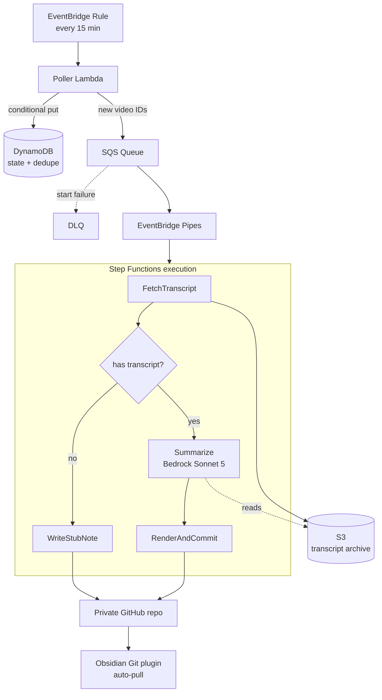

# Architecture

## Why these choices

**Custom playlist, not Watch Later.** Google removed API access to `WL` in 2016; `playlistItems.list` returns empty or 403 even with the owner's OAuth token. A user-created playlist is fully readable.

**Transcript provider behind an interface.** YouTube blocks datacenter IPs, so calling the caption endpoint from Lambda fails often. The provider seam allows swapping the free-tier API for a residential proxy without touching the pipeline.

**S3 transcript archive.** Prompt iteration is inevitable. Re-summarizing the archive costs Bedrock tokens and zero transcript API calls. It also sidesteps the Step Functions 256KB inter-state payload limit — long transcripts exceed it, so states pass S3 keys.

**Step Functions over a single Lambda.** Per-step retry means a failed GitHub commit does not re-fetch the transcript, protecting a rate-limited external resource.

**Structured outputs.** The model returns validated JSON matching a schema; the renderer owns all markdown formatting. Note layout is deterministic and unit-tested independently of the model.
