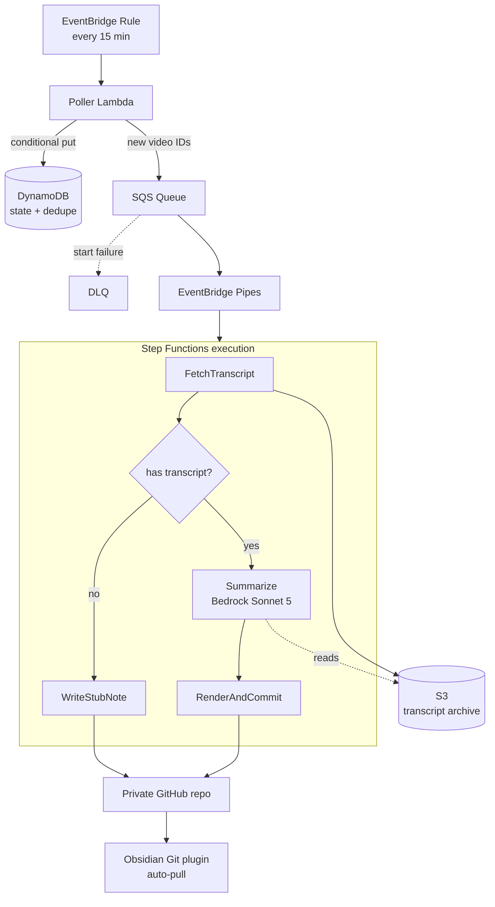

# Video Vault Implementation Plan

> **For agentic workers:** REQUIRED SUB-SKILL: Use superpowers:subagent-driven-development (recommended) or superpowers:executing-plans to implement this plan task-by-task. Steps use checkbox (`- [ ]`) syntax for tracking.

**Goal:** Automatically summarize every YouTube video saved to a designated playlist and commit the summary as a markdown note into a private Obsidian vault repo.

**Architecture:** An EventBridge rule triggers a poller Lambda every 15 minutes, which diffs a YouTube playlist against DynamoDB and enqueues new video IDs to SQS. EventBridge Pipes starts one Step Functions execution per video: fetch transcript → S3, summarize with Claude Sonnet 5 on Bedrock using structured outputs, render markdown, commit to GitHub. Obsidian's Git plugin pulls the repo.

**Tech Stack:** Python 3.12, AWS CDK (Python), Lambda, Step Functions, DynamoDB, S3, SQS, EventBridge, SSM Parameter Store, Amazon Bedrock (`anthropic.claude-sonnet-5`), pytest + moto + respx, GitHub Actions with OIDC.

**Spec:** `docs/superpowers/specs/2026-07-23-video-vault-design.md`

## Global Constraints

- Python 3.12 for all Lambda runtimes and local development.
- Bedrock model ID is exactly `anthropic.claude-sonnet-5`. Never a first-party ID, never a date suffix.
- Bedrock requests must set `thinking={"type": "disabled"}` and must NOT set `temperature`, `top_p`, or `top_k` — Sonnet 5 returns 400 on non-default sampling parameters.
- All JSON schemas passed to `output_config.format` must set `additionalProperties: false` and list every property in `required`. No `minLength`, `maxLength`, `minimum`, or `maximum` — structured outputs reject them.
- Secrets live only in SSM Parameter Store as `SecureString`. Never in environment variables, never in code, never in the repo.
- Every Lambda gets its own IAM role with least-privilege policies. No shared roles, no wildcards on resource ARNs except where AWS requires them.
- All timestamps stored as ISO 8601 UTC strings.
- Vault note paths follow `Video Vault/{year}/{slug}-{video_id}.md`.
- One S3 bucket holds two prefixes: `transcripts/{video_id}.json` (raw provider response) and `summaries/{video_id}.json` (self-contained summary artifact). Env var is `CONTENT_BUCKET`.
- Commit after every task. Conventional commit prefixes (`feat:`, `test:`, `chore:`, `docs:`).
- Run `ruff check . && ruff format --check . && pytest` before every commit.

---

### Task 1: Project scaffolding and empty CDK stack

**Files:**
- Create: `pyproject.toml`
- Create: `requirements.txt`
- Create: `requirements-dev.txt`
- Create: `cdk.json`
- Create: `app.py`
- Create: `infra/__init__.py`
- Create: `infra/pipeline_stack.py`
- Create: `src/__init__.py`
- Create: `.gitignore`
- Test: `tests/infra/test_stack_synth.py`

**Interfaces:**
- Consumes: nothing.
- Produces: `infra.pipeline_stack.VideoVaultStack(scope, construct_id, **kwargs)` — the single CDK stack every later infra task extends.

- [ ] **Step 1: Create `.gitignore`**

```gitignore
__pycache__/
*.py[cod]
.venv/
venv/
.pytest_cache/
.ruff_cache/
cdk.out/
.env
*.egg-info/
.coverage
```

- [ ] **Step 2: Create `requirements.txt`**

```
aws-cdk-lib>=2.150.0,<3.0.0
constructs>=10.0.0,<11.0.0
```

- [ ] **Step 3: Create `requirements-dev.txt`**

```
pytest>=8.0.0
pytest-cov>=5.0.0
moto[dynamodb,s3,sqs,ssm]>=5.0.0
respx>=0.21.0
httpx>=0.27.0
anthropic[bedrock]>=0.40.0
boto3>=1.34.0
ruff>=0.6.0
```

- [ ] **Step 4: Create `pyproject.toml`**

```toml
[project]
name = "video-vault"
version = "0.1.0"
requires-python = ">=3.12"

[tool.pytest.ini_options]
testpaths = ["tests"]
pythonpath = ["."]
addopts = "-v"

[tool.ruff]
line-length = 100
target-version = "py312"

[tool.ruff.lint]
select = ["E", "F", "I", "UP", "B"]
```

- [ ] **Step 5: Create `cdk.json`**

```json
{
  "app": "python3 app.py",
  "context": {
    "@aws-cdk/core:newStyleStackSynthesis": true
  }
}
```

- [ ] **Step 6: Create the empty stack**

`infra/__init__.py` — empty file.

`infra/pipeline_stack.py`:

```python
from aws_cdk import Stack
from constructs import Construct


class VideoVaultStack(Stack):
    def __init__(self, scope: Construct, construct_id: str, **kwargs) -> None:
        super().__init__(scope, construct_id, **kwargs)
```

- [ ] **Step 7: Create `app.py`**

```python
#!/usr/bin/env python3
import aws_cdk as cdk

from infra.pipeline_stack import VideoVaultStack

app = cdk.App()
VideoVaultStack(app, "VideoVaultStack")
app.synth()
```

- [ ] **Step 8: Create `src/__init__.py`**

Empty file.

- [ ] **Step 9: Create `tests/conftest.py`**

Sets a default AWS region for the whole suite so production code can construct
boto3 clients without hardcoding one.

```python
import os

os.environ.setdefault("AWS_DEFAULT_REGION", "us-east-1")
os.environ.setdefault("AWS_ACCESS_KEY_ID", "testing")
os.environ.setdefault("AWS_SECRET_ACCESS_KEY", "testing")
```

- [ ] **Step 10: Write the failing test**

`tests/infra/test_stack_synth.py`:

```python
import aws_cdk as cdk
from aws_cdk.assertions import Template

from infra.pipeline_stack import VideoVaultStack


def test_stack_synthesizes():
    app = cdk.App()
    stack = VideoVaultStack(app, "TestStack")
    template = Template.from_stack(stack)
    assert template.to_json() is not None
```

- [ ] **Step 11: Install dependencies and run the test**

Run:
```bash
python3 -m venv .venv && . .venv/bin/activate
pip install -r requirements.txt -r requirements-dev.txt
pytest tests/infra/test_stack_synth.py -v
```
Expected: PASS.

- [ ] **Step 12: Verify CDK synth works**

Run: `npx aws-cdk@2 synth`
Expected: emits CloudFormation YAML to stdout, exits 0.

- [ ] **Step 13: Commit**

```bash
git add pyproject.toml requirements.txt requirements-dev.txt cdk.json app.py infra/ src/__init__.py .gitignore tests/
git commit -m "chore: scaffold CDK app and test harness"
```

---

### Task 2: Domain models

**Files:**
- Create: `src/shared/__init__.py`
- Create: `src/shared/models.py`
- Test: `tests/unit/test_models.py`

**Interfaces:**
- Consumes: nothing.
- Produces:
  - `VideoMeta(video_id: str, title: str, channel: str, published_at: str, duration_seconds: int)`
  - `TranscriptSegment(start_seconds: int, text: str)`
  - `Transcript(video_id: str, segments: list[TranscriptSegment], language: str)` with `.full_text` property and `.to_dict()` / `Transcript.from_dict()`
  - `Section(start_seconds: int, title: str, summary: str)`
  - `Summary(verdict: str, tldr: str, takeaways: list[str], sections: list[Section], tags: list[str])` with `Summary.from_dict()`

- [ ] **Step 1: Write the failing test**

`tests/unit/test_models.py`:

```python
from src.shared.models import Section, Summary, Transcript, TranscriptSegment, VideoMeta


def test_transcript_full_text_joins_segments():
    t = Transcript(
        video_id="abc123",
        segments=[
            TranscriptSegment(start_seconds=0, text="Hello"),
            TranscriptSegment(start_seconds=5, text="world"),
        ],
        language="en",
    )
    assert t.full_text == "Hello world"


def test_transcript_roundtrips_through_dict():
    t = Transcript(
        video_id="abc123",
        segments=[TranscriptSegment(start_seconds=12, text="hi")],
        language="en",
    )
    assert Transcript.from_dict(t.to_dict()) == t


def test_summary_from_dict_builds_sections():
    s = Summary.from_dict(
        {
            "verdict": "Skip it.",
            "tldr": "Not much here.",
            "takeaways": ["one", "two"],
            "sections": [{"start_seconds": 0, "title": "Intro", "summary": "Framing."}],
            "tags": ["python"],
        }
    )
    assert s.sections[0] == Section(start_seconds=0, title="Intro", summary="Framing.")
    assert s.takeaways == ["one", "two"]


def test_video_meta_holds_fields():
    v = VideoMeta(
        video_id="abc123",
        title="A Title",
        channel="A Channel",
        published_at="2026-07-01T00:00:00Z",
        duration_seconds=3862,
    )
    assert v.duration_seconds == 3862
```

- [ ] **Step 2: Run test to verify it fails**

Run: `pytest tests/unit/test_models.py -v`
Expected: FAIL with `ModuleNotFoundError: No module named 'src.shared'`

- [ ] **Step 3: Write the implementation**

`src/shared/__init__.py` — empty file.

`src/shared/models.py`:

```python
from __future__ import annotations

from dataclasses import dataclass, field


@dataclass(frozen=True)
class VideoMeta:
    video_id: str
    title: str
    channel: str
    published_at: str
    duration_seconds: int


@dataclass(frozen=True)
class TranscriptSegment:
    start_seconds: int
    text: str


@dataclass(frozen=True)
class Transcript:
    video_id: str
    segments: list[TranscriptSegment]
    language: str

    @property
    def full_text(self) -> str:
        return " ".join(seg.text.strip() for seg in self.segments if seg.text.strip())

    def to_dict(self) -> dict:
        return {
            "video_id": self.video_id,
            "language": self.language,
            "segments": [
                {"start_seconds": s.start_seconds, "text": s.text} for s in self.segments
            ],
        }

    @classmethod
    def from_dict(cls, data: dict) -> Transcript:
        return cls(
            video_id=data["video_id"],
            language=data["language"],
            segments=[
                TranscriptSegment(start_seconds=int(s["start_seconds"]), text=s["text"])
                for s in data["segments"]
            ],
        )


@dataclass(frozen=True)
class Section:
    start_seconds: int
    title: str
    summary: str


@dataclass(frozen=True)
class Summary:
    verdict: str
    tldr: str
    takeaways: list[str] = field(default_factory=list)
    sections: list[Section] = field(default_factory=list)
    tags: list[str] = field(default_factory=list)

    @classmethod
    def from_dict(cls, data: dict) -> Summary:
        return cls(
            verdict=data["verdict"],
            tldr=data["tldr"],
            takeaways=list(data["takeaways"]),
            sections=[
                Section(
                    start_seconds=int(s["start_seconds"]),
                    title=s["title"],
                    summary=s["summary"],
                )
                for s in data["sections"]
            ],
            tags=list(data["tags"]),
        )
```

- [ ] **Step 4: Run test to verify it passes**

Run: `pytest tests/unit/test_models.py -v`
Expected: 4 passed.

- [ ] **Step 5: Commit**

```bash
git add src/shared/ tests/unit/test_models.py
git commit -m "feat: add domain models for video, transcript, and summary"
```

---

### Task 3: Note renderer

Pure function, no I/O. Highest-value unit tests in the project — this is what determines whether your notes are usable.

**Files:**
- Create: `src/notes/__init__.py`
- Create: `src/notes/renderer.py`
- Test: `tests/unit/test_renderer.py`

**Interfaces:**
- Consumes: `VideoMeta`, `Summary`, `Section` from `src.shared.models`.
- Produces:
  - `format_timestamp(seconds: int) -> str`
  - `slugify(title: str, max_len: int = 80) -> str`
  - `note_path(meta: VideoMeta) -> str`
  - `render_note(meta: VideoMeta, summary: Summary, saved_at: str, summarized_at: str) -> str`
  - `render_stub_note(meta: VideoMeta, saved_at: str, reason: str) -> str`

- [ ] **Step 1: Write the failing test**

`tests/unit/test_renderer.py`:

```python
from src.notes.renderer import (
    format_timestamp,
    note_path,
    render_note,
    render_stub_note,
    slugify,
)
from src.shared.models import Section, Summary, VideoMeta

META = VideoMeta(
    video_id="dQw4w9WgXcQ",
    title='How "Scheduling" Works: A Deep/Dive',
    channel="Some Channel",
    published_at="2026-07-01T12:00:00Z",
    duration_seconds=3862,
)

SUMMARY = Summary(
    verdict="Worth watching 18:40-31:00.",
    tldr="It explains scheduling.",
    takeaways=["First point", "Second point"],
    sections=[
        Section(start_seconds=0, title="Intro", summary="Framing."),
        Section(start_seconds=1120, title="Custom scheduler", summary="The good part."),
    ],
    tags=["kubernetes", "scheduling"],
)


def test_format_timestamp_under_an_hour():
    assert format_timestamp(252) == "4:12"


def test_format_timestamp_over_an_hour():
    assert format_timestamp(3862) == "1:04:22"


def test_format_timestamp_zero():
    assert format_timestamp(0) == "0:00"


def test_slugify_strips_filesystem_unsafe_characters():
    assert slugify('How "Scheduling" Works: A Deep/Dive') == 'How "Scheduling" Works A DeepDive'


def test_slugify_truncates_and_strips_trailing_dots():
    assert len(slugify("x" * 200)) == 80


def test_note_path_uses_year_and_video_id():
    assert note_path(META).startswith("Video Vault/2026/")
    assert note_path(META).endswith("-dQw4w9WgXcQ.md")


def test_render_note_contains_frontmatter_and_clickable_timestamps():
    out = render_note(META, SUMMARY, saved_at="2026-07-22", summarized_at="2026-07-22")
    assert out.startswith("---\n")
    assert 'video_id: "dQw4w9WgXcQ"' in out
    assert "status: summarized" in out
    assert "> **Verdict:** Worth watching 18:40-31:00." in out
    assert "- First point" in out
    assert "[18:40](https://www.youtube.com/watch?v=dQw4w9WgXcQ&t=1120)" in out
    assert "duration: \"1:04:22\"" in out


def test_render_note_quotes_titles_containing_colons():
    out = render_note(META, SUMMARY, saved_at="2026-07-22", summarized_at="2026-07-22")
    assert 'title: "How \\"Scheduling\\" Works: A Deep/Dive"' in out


def test_render_stub_note_marks_missing_transcript():
    out = render_stub_note(META, saved_at="2026-07-22", reason="no captions available")
    assert "status: no-transcript" in out
    assert "no captions available" in out
    assert "https://www.youtube.com/watch?v=dQw4w9WgXcQ" in out
```

- [ ] **Step 2: Run test to verify it fails**

Run: `pytest tests/unit/test_renderer.py -v`
Expected: FAIL with `ModuleNotFoundError: No module named 'src.notes'`

- [ ] **Step 3: Write the implementation**

`src/notes/__init__.py` — empty file.

`src/notes/renderer.py`:

```python
from __future__ import annotations

import json
import re

from src.shared.models import Summary, VideoMeta

WATCH_URL = "https://www.youtube.com/watch?v={video_id}"
TIMESTAMP_URL = "https://www.youtube.com/watch?v={video_id}&t={seconds}"

_UNSAFE_CHARS = re.compile(r'[<>:/\\|?*\x00-\x1f]')
_WHITESPACE = re.compile(r"\s+")


def format_timestamp(seconds: int) -> str:
    hours, remainder = divmod(int(seconds), 3600)
    minutes, secs = divmod(remainder, 60)
    if hours:
        return f"{hours}:{minutes:02d}:{secs:02d}"
    return f"{minutes}:{secs:02d}"


def slugify(title: str, max_len: int = 80) -> str:
    cleaned = _UNSAFE_CHARS.sub("", title)
    cleaned = _WHITESPACE.sub(" ", cleaned).strip()
    return cleaned[:max_len].rstrip(" .")


def note_path(meta: VideoMeta) -> str:
    year = meta.published_at[:4]
    return f"Video Vault/{year}/{slugify(meta.title)}-{meta.video_id}.md"


def _yaml_str(value: str) -> str:
    """JSON string literals are valid YAML strings and handle all escaping."""
    return json.dumps(value)


def _frontmatter(meta: VideoMeta, saved_at: str, extra: dict[str, str]) -> list[str]:
    lines = [
        "---",
        f"title: {_yaml_str(meta.title)}",
        f"channel: {_yaml_str(meta.channel)}",
        f"url: {WATCH_URL.format(video_id=meta.video_id)}",
        f"video_id: {_yaml_str(meta.video_id)}",
        f"duration: {_yaml_str(format_timestamp(meta.duration_seconds))}",
        f"published: {meta.published_at[:10]}",
        f"saved: {saved_at}",
    ]
    for key, value in extra.items():
        lines.append(f"{key}: {value}")
    lines.append("---")
    return lines


def render_note(
    meta: VideoMeta, summary: Summary, saved_at: str, summarized_at: str
) -> str:
    tags = ", ".join(["video-vault", *summary.tags])
    lines = _frontmatter(
        meta,
        saved_at,
        {
            "summarized": summarized_at,
            "tags": f"[{tags}]",
            "status": "summarized",
        },
    )

    lines += [
        "",
        f"# {meta.title}",
        "",
        f"> **Verdict:** {summary.verdict}",
        "",
        "## TL;DR",
        "",
        summary.tldr,
        "",
        "## Key takeaways",
        "",
    ]
    lines += [f"- {item}" for item in summary.takeaways]
    lines += ["", "## Sections", ""]

    for section in summary.sections:
        stamp = format_timestamp(section.start_seconds)
        url = TIMESTAMP_URL.format(video_id=meta.video_id, seconds=section.start_seconds)
        lines.append(f"- [{stamp}]({url}) — {section.title}: {section.summary}")

    lines.append("")
    return "\n".join(lines)


def render_stub_note(meta: VideoMeta, saved_at: str, reason: str) -> str:
    lines = _frontmatter(
        meta,
        saved_at,
        {"tags": "[video-vault, no-transcript]", "status": "no-transcript"},
    )
    lines += [
        "",
        f"# {meta.title}",
        "",
        f"> **No summary available:** {reason}. This one needs watching.",
        "",
        f"[Watch on YouTube]({WATCH_URL.format(video_id=meta.video_id)})",
        "",
    ]
    return "\n".join(lines)
```

- [ ] **Step 4: Run test to verify it passes**

Run: `pytest tests/unit/test_renderer.py -v`
Expected: 9 passed.

- [ ] **Step 5: Commit**

```bash
git add src/notes/ tests/unit/test_renderer.py
git commit -m "feat: add markdown note renderer with timestamped section links"
```

---

### Task 4: Transcript provider seam

**Files:**
- Create: `src/transcript/__init__.py`
- Create: `src/transcript/base.py`
- Create: `src/transcript/fake_provider.py`
- Test: `tests/unit/test_transcript_base.py`

**Interfaces:**
- Consumes: `Transcript`, `TranscriptSegment` from `src.shared.models`.
- Produces:
  - `TranscriptProvider` ABC with `fetch(video_id: str) -> Transcript | None` (returns `None` when no captions exist)
  - `TranscriptUnavailable(Exception)` — raised for transient failures that should be retried
  - `FakeTranscriptProvider(responses: dict[str, Transcript | None])` for tests

- [ ] **Step 1: Write the failing test**

`tests/unit/test_transcript_base.py`:

```python
import pytest

from src.shared.models import Transcript, TranscriptSegment
from src.transcript.base import TranscriptProvider, TranscriptUnavailable
from src.transcript.fake_provider import FakeTranscriptProvider

TRANSCRIPT = Transcript(
    video_id="abc123",
    segments=[TranscriptSegment(start_seconds=0, text="hello")],
    language="en",
)


def test_fake_provider_returns_configured_transcript():
    provider = FakeTranscriptProvider({"abc123": TRANSCRIPT})
    assert provider.fetch("abc123") == TRANSCRIPT


def test_fake_provider_returns_none_for_missing_captions():
    provider = FakeTranscriptProvider({"abc123": None})
    assert provider.fetch("abc123") is None


def test_fake_provider_raises_for_unconfigured_video():
    provider = FakeTranscriptProvider({})
    with pytest.raises(TranscriptUnavailable):
        provider.fetch("unknown")


def test_provider_abc_cannot_be_instantiated():
    with pytest.raises(TypeError):
        TranscriptProvider()
```

- [ ] **Step 2: Run test to verify it fails**

Run: `pytest tests/unit/test_transcript_base.py -v`
Expected: FAIL with `ModuleNotFoundError: No module named 'src.transcript'`

- [ ] **Step 3: Write the implementation**

`src/transcript/__init__.py` — empty file.

`src/transcript/base.py`:

```python
from __future__ import annotations

from abc import ABC, abstractmethod

from src.shared.models import Transcript


class TranscriptUnavailable(Exception):
    """Transient failure fetching a transcript. Safe to retry."""


class TranscriptProvider(ABC):
    @abstractmethod
    def fetch(self, video_id: str) -> Transcript | None:
        """Return the transcript, or None if the video has no captions.

        Raises TranscriptUnavailable on transient failures.
        """
```

`src/transcript/fake_provider.py`:

```python
from __future__ import annotations

from src.shared.models import Transcript
from src.transcript.base import TranscriptProvider, TranscriptUnavailable


class FakeTranscriptProvider(TranscriptProvider):
    def __init__(self, responses: dict[str, Transcript | None]) -> None:
        self._responses = responses

    def fetch(self, video_id: str) -> Transcript | None:
        if video_id not in self._responses:
            raise TranscriptUnavailable(f"no fake response configured for {video_id}")
        return self._responses[video_id]
```

- [ ] **Step 4: Run test to verify it passes**

Run: `pytest tests/unit/test_transcript_base.py -v`
Expected: 4 passed.

- [ ] **Step 5: Commit**

```bash
git add src/transcript/ tests/unit/test_transcript_base.py
git commit -m "feat: add transcript provider interface and test double"
```

---

### Task 5: API transcript provider

> **Verify before implementing:** open the transcript vendor's current API docs and confirm the endpoint path, auth header name, and response field names. The mapping below targets Supadata's documented shape (`GET /v1/youtube/transcript?videoId=...`, `x-api-key` header, `{"content": [{"text", "offset"}], "lang": "..."}` where `offset` is milliseconds). If the vendor's shape differs, update `_to_transcript` and the fixture in the test — the rest of the class is unaffected. This isolation is the whole point of the provider seam.

**Files:**
- Create: `src/transcript/api_provider.py`
- Create: `src/transcript/factory.py`
- Test: `tests/unit/test_api_provider.py`

**Interfaces:**
- Consumes: `TranscriptProvider`, `TranscriptUnavailable` from `src.transcript.base`.
- Produces:
  - `ApiTranscriptProvider(api_key: str, base_url: str = "https://api.supadata.ai/v1", timeout: float = 30.0)`
  - `build_provider(api_key: str) -> TranscriptProvider` in `factory.py`, selected by the `TRANSCRIPT_PROVIDER` env var (`api` is the only value today)

- [ ] **Step 1: Write the failing test**

`tests/unit/test_api_provider.py`:

```python
import httpx
import pytest
import respx

from src.transcript.api_provider import ApiTranscriptProvider
from src.transcript.base import TranscriptUnavailable

BASE = "https://api.supadata.ai/v1"


@respx.mock
def test_fetch_maps_response_to_transcript():
    respx.get(f"{BASE}/youtube/transcript").mock(
        return_value=httpx.Response(
            200,
            json={
                "lang": "en",
                "content": [
                    {"text": "Hello there", "offset": 0},
                    {"text": "second bit", "offset": 5500},
                ],
            },
        )
    )
    provider = ApiTranscriptProvider(api_key="k", base_url=BASE)
    result = provider.fetch("abc123")

    assert result is not None
    assert result.language == "en"
    assert result.segments[0].start_seconds == 0
    assert result.segments[1].start_seconds == 5
    assert result.full_text == "Hello there second bit"


@respx.mock
def test_fetch_sends_api_key_header():
    route = respx.get(f"{BASE}/youtube/transcript").mock(
        return_value=httpx.Response(200, json={"lang": "en", "content": []})
    )
    ApiTranscriptProvider(api_key="secret-key", base_url=BASE).fetch("abc123")
    assert route.calls.last.request.headers["x-api-key"] == "secret-key"


@respx.mock
def test_fetch_returns_none_when_no_captions():
    respx.get(f"{BASE}/youtube/transcript").mock(return_value=httpx.Response(404))
    provider = ApiTranscriptProvider(api_key="k", base_url=BASE)
    assert provider.fetch("abc123") is None


@respx.mock
def test_fetch_raises_on_rate_limit():
    respx.get(f"{BASE}/youtube/transcript").mock(return_value=httpx.Response(429))
    provider = ApiTranscriptProvider(api_key="k", base_url=BASE)
    with pytest.raises(TranscriptUnavailable):
        provider.fetch("abc123")


@respx.mock
def test_fetch_raises_on_server_error():
    respx.get(f"{BASE}/youtube/transcript").mock(return_value=httpx.Response(503))
    provider = ApiTranscriptProvider(api_key="k", base_url=BASE)
    with pytest.raises(TranscriptUnavailable):
        provider.fetch("abc123")


@respx.mock
def test_fetch_raises_on_network_error():
    respx.get(f"{BASE}/youtube/transcript").mock(side_effect=httpx.ConnectError("boom"))
    provider = ApiTranscriptProvider(api_key="k", base_url=BASE)
    with pytest.raises(TranscriptUnavailable):
        provider.fetch("abc123")
```

- [ ] **Step 2: Run test to verify it fails**

Run: `pytest tests/unit/test_api_provider.py -v`
Expected: FAIL with `ModuleNotFoundError: No module named 'src.transcript.api_provider'`

- [ ] **Step 3: Write the implementation**

`src/transcript/api_provider.py`:

```python
from __future__ import annotations

import httpx

from src.shared.models import Transcript, TranscriptSegment
from src.transcript.base import TranscriptProvider, TranscriptUnavailable

DEFAULT_BASE_URL = "https://api.supadata.ai/v1"


class ApiTranscriptProvider(TranscriptProvider):
    def __init__(
        self,
        api_key: str,
        base_url: str = DEFAULT_BASE_URL,
        timeout: float = 30.0,
    ) -> None:
        self._api_key = api_key
        self._base_url = base_url.rstrip("/")
        self._timeout = timeout

    def fetch(self, video_id: str) -> Transcript | None:
        try:
            response = httpx.get(
                f"{self._base_url}/youtube/transcript",
                params={"videoId": video_id},
                headers={"x-api-key": self._api_key},
                timeout=self._timeout,
            )
        except httpx.HTTPError as exc:
            raise TranscriptUnavailable(f"network error for {video_id}: {exc}") from exc

        if response.status_code == 404:
            return None
        if response.status_code >= 400:
            raise TranscriptUnavailable(
                f"provider returned {response.status_code} for {video_id}"
            )

        return self._to_transcript(video_id, response.json())

    @staticmethod
    def _to_transcript(video_id: str, payload: dict) -> Transcript:
        """Map the vendor payload to our model. Vendor offsets are milliseconds."""
        segments = [
            TranscriptSegment(
                start_seconds=int(item.get("offset", 0)) // 1000,
                text=item.get("text", ""),
            )
            for item in payload.get("content", [])
        ]
        return Transcript(
            video_id=video_id,
            segments=segments,
            language=payload.get("lang", "unknown"),
        )
```

`src/transcript/factory.py`:

```python
from __future__ import annotations

import os

from src.transcript.api_provider import ApiTranscriptProvider
from src.transcript.base import TranscriptProvider


def build_provider(api_key: str) -> TranscriptProvider:
    kind = os.environ.get("TRANSCRIPT_PROVIDER", "api")
    if kind == "api":
        return ApiTranscriptProvider(api_key=api_key)
    raise ValueError(f"unknown TRANSCRIPT_PROVIDER: {kind}")
```

- [ ] **Step 4: Run test to verify it passes**

Run: `pytest tests/unit/test_api_provider.py -v`
Expected: 6 passed.

- [ ] **Step 5: Commit**

```bash
git add src/transcript/api_provider.py src/transcript/factory.py tests/unit/test_api_provider.py
git commit -m "feat: add HTTP transcript provider with retryable error mapping"
```

---

### Task 6: Bedrock summarizer

**Files:**
- Create: `src/summarize/__init__.py`
- Create: `src/summarize/schema.py`
- Create: `src/summarize/prompt.py`
- Create: `src/summarize/summarizer.py`
- Test: `tests/unit/test_summarizer.py`

**Interfaces:**
- Consumes: `Transcript`, `Summary`, `VideoMeta` from `src.shared.models`.
- Produces:
  - `SUMMARY_SCHEMA: dict` in `schema.py`
  - `SYSTEM_PROMPT: str` and `build_user_message(meta, transcript) -> str` in `prompt.py`
  - `Summarizer(client)` with `summarize(meta: VideoMeta, transcript: Transcript) -> Summary`
  - `build_summarizer() -> Summarizer` constructing an `AnthropicBedrockMantle` client from `BEDROCK_REGION`

- [ ] **Step 1: Write the failing test**

`tests/unit/test_summarizer.py`:

```python
import json
from types import SimpleNamespace
from unittest.mock import MagicMock

from src.shared.models import Transcript, TranscriptSegment, VideoMeta
from src.summarize.schema import SUMMARY_SCHEMA
from src.summarize.summarizer import Summarizer

META = VideoMeta(
    video_id="abc123",
    title="A Title",
    channel="A Channel",
    published_at="2026-07-01T00:00:00Z",
    duration_seconds=600,
)
TRANSCRIPT = Transcript(
    video_id="abc123",
    segments=[TranscriptSegment(start_seconds=0, text="hello world")],
    language="en",
)

PAYLOAD = {
    "verdict": "Skim it.",
    "tldr": "Short summary.",
    "takeaways": ["one"],
    "sections": [{"start_seconds": 0, "title": "Intro", "summary": "Framing."}],
    "tags": ["python"],
}


def _fake_client(payload: dict) -> MagicMock:
    client = MagicMock()
    client.messages.create.return_value = SimpleNamespace(
        content=[SimpleNamespace(type="text", text=json.dumps(payload))]
    )
    return client


def test_summarize_parses_structured_output():
    summarizer = Summarizer(_fake_client(PAYLOAD))
    result = summarizer.summarize(META, TRANSCRIPT)
    assert result.verdict == "Skim it."
    assert result.sections[0].start_seconds == 0
    assert result.tags == ["python"]


def test_summarize_uses_correct_bedrock_model_id():
    client = _fake_client(PAYLOAD)
    Summarizer(client).summarize(META, TRANSCRIPT)
    kwargs = client.messages.create.call_args.kwargs
    assert kwargs["model"] == "anthropic.claude-sonnet-5"


def test_summarize_disables_thinking_and_omits_sampling_params():
    client = _fake_client(PAYLOAD)
    Summarizer(client).summarize(META, TRANSCRIPT)
    kwargs = client.messages.create.call_args.kwargs
    assert kwargs["thinking"] == {"type": "disabled"}
    assert "temperature" not in kwargs
    assert "top_p" not in kwargs
    assert "top_k" not in kwargs


def test_summarize_requests_structured_output():
    client = _fake_client(PAYLOAD)
    Summarizer(client).summarize(META, TRANSCRIPT)
    kwargs = client.messages.create.call_args.kwargs
    assert kwargs["output_config"]["format"]["schema"] == SUMMARY_SCHEMA
    assert kwargs["output_config"]["effort"] == "low"


def test_schema_satisfies_structured_output_constraints():
    def check(node: dict) -> None:
        if node.get("type") == "object":
            assert node["additionalProperties"] is False
            assert set(node["required"]) == set(node["properties"])
            for child in node["properties"].values():
                check(child)
        if node.get("type") == "array":
            check(node["items"])

    check(SUMMARY_SCHEMA)
```

- [ ] **Step 2: Run test to verify it fails**

Run: `pytest tests/unit/test_summarizer.py -v`
Expected: FAIL with `ModuleNotFoundError: No module named 'src.summarize'`

- [ ] **Step 3: Write the schema**

`src/summarize/__init__.py` — empty file.

`src/summarize/schema.py`:

```python
SUMMARY_SCHEMA = {
    "type": "object",
    "properties": {
        "verdict": {
            "type": "string",
            "description": (
                "One sentence: is this worth watching, and if only partly, "
                "which timestamp range matters."
            ),
        },
        "tldr": {
            "type": "string",
            "description": "Exactly three sentences covering the argument and audience.",
        },
        "takeaways": {
            "type": "array",
            "description": "Five to eight concrete takeaways.",
            "items": {"type": "string"},
        },
        "sections": {
            "type": "array",
            "description": "Chronological outline of the video.",
            "items": {
                "type": "object",
                "properties": {
                    "start_seconds": {
                        "type": "integer",
                        "description": "Start offset in whole seconds from video start.",
                    },
                    "title": {"type": "string"},
                    "summary": {"type": "string"},
                },
                "required": ["start_seconds", "title", "summary"],
                "additionalProperties": False,
            },
        },
        "tags": {
            "type": "array",
            "description": "Three to six lowercase topic tags, no spaces.",
            "items": {"type": "string"},
        },
    },
    "required": ["verdict", "tldr", "takeaways", "sections", "tags"],
    "additionalProperties": False,
}
```

- [ ] **Step 4: Write the prompt**

`src/summarize/prompt.py`:

```python
from __future__ import annotations

from src.shared.models import Transcript, VideoMeta

SYSTEM_PROMPT = """\
You summarize YouTube transcripts for a reader who does not have time to watch \
the video and wants to decide whether it is worth watching at all.

Rules:
- The verdict is the most important field. Say plainly whether the video is worth \
watching in full, worth skimming via this summary alone, or worth watching only a \
specific timestamp range. Be willing to say a video is not worth watching.
- Ground every takeaway in something actually said in the transcript. Do not \
generalize beyond it or add outside knowledge.
- start_seconds must be a real offset taken from the transcript timestamps, not an \
estimate. Sections must be in ascending chronological order.
- Aim for six to twelve sections on a one-hour video, scaled to length and density.
- Write plainly. No filler, no "in this video the speaker discusses" phrasing.\
"""


def build_user_message(meta: VideoMeta, transcript: Transcript) -> str:
    lines = [
        f"Title: {meta.title}",
        f"Channel: {meta.channel}",
        f"Duration: {meta.duration_seconds} seconds",
        "",
        "Transcript segments, formatted as [start_seconds] text:",
        "",
    ]
    lines += [f"[{seg.start_seconds}] {seg.text}" for seg in transcript.segments]
    return "\n".join(lines)
```

- [ ] **Step 5: Write the summarizer**

`src/summarize/summarizer.py`:

```python
from __future__ import annotations

import json
import os

from src.shared.models import Summary, Transcript, VideoMeta
from src.summarize.prompt import SYSTEM_PROMPT, build_user_message
from src.summarize.schema import SUMMARY_SCHEMA

MODEL_ID = "anthropic.claude-sonnet-5"
MAX_TOKENS = 8192


class Summarizer:
    def __init__(self, client) -> None:
        self._client = client

    def summarize(self, meta: VideoMeta, transcript: Transcript) -> Summary:
        response = self._client.messages.create(
            model=MODEL_ID,
            max_tokens=MAX_TOKENS,
            thinking={"type": "disabled"},
            output_config={
                "effort": "low",
                "format": {"type": "json_schema", "schema": SUMMARY_SCHEMA},
            },
            system=SYSTEM_PROMPT,
            messages=[{"role": "user", "content": build_user_message(meta, transcript)}],
        )
        text = next(block.text for block in response.content if block.type == "text")
        return Summary.from_dict(json.loads(text))


def build_summarizer() -> Summarizer:
    from anthropic import AnthropicBedrockMantle

    client = AnthropicBedrockMantle(aws_region=os.environ["BEDROCK_REGION"])
    return Summarizer(client)
```

- [ ] **Step 6: Run test to verify it passes**

Run: `pytest tests/unit/test_summarizer.py -v`
Expected: 5 passed.

- [ ] **Step 7: Commit**

```bash
git add src/summarize/ tests/unit/test_summarizer.py
git commit -m "feat: add Bedrock summarizer with structured output schema"
```

---

### Task 7: GitHub vault committer

**Files:**
- Create: `src/vault_repo/__init__.py`
- Create: `src/vault_repo/committer.py`
- Test: `tests/unit/test_committer.py`

**Interfaces:**
- Consumes: nothing from earlier tasks.
- Produces:
  - `CommitFailed(Exception)`
  - `VaultCommitter(token: str, owner: str, repo: str, branch: str = "main", base_url: str = "https://api.github.com")` with `commit_note(path: str, content: str, message: str) -> None`

- [ ] **Step 1: Write the failing test**

`tests/unit/test_committer.py`:

```python
import base64
import json

import httpx
import pytest
import respx

from src.vault_repo.committer import CommitFailed, VaultCommitter

BASE = "https://api.github.com"
CONTENTS = f"{BASE}/repos/me/vault/contents/Video Vault/2026/note.md"


def _committer() -> VaultCommitter:
    return VaultCommitter(token="t", owner="me", repo="vault", base_url=BASE)


@respx.mock
def test_creates_new_file_without_sha():
    respx.get(CONTENTS).mock(return_value=httpx.Response(404))
    put = respx.put(CONTENTS).mock(return_value=httpx.Response(201, json={}))

    _committer().commit_note("Video Vault/2026/note.md", "# hello", "feat: add note")

    body = json.loads(put.calls.last.request.content)
    assert "sha" not in body
    assert base64.b64decode(body["content"]).decode() == "# hello"
    assert body["branch"] == "main"


@respx.mock
def test_updates_existing_file_with_sha():
    respx.get(CONTENTS).mock(return_value=httpx.Response(200, json={"sha": "abc123"}))
    put = respx.put(CONTENTS).mock(return_value=httpx.Response(200, json={}))

    _committer().commit_note("Video Vault/2026/note.md", "# hello", "feat: update")

    assert json.loads(put.calls.last.request.content)["sha"] == "abc123"


@respx.mock
def test_sends_bearer_token():
    respx.get(CONTENTS).mock(return_value=httpx.Response(404))
    put = respx.put(CONTENTS).mock(return_value=httpx.Response(201, json={}))

    _committer().commit_note("Video Vault/2026/note.md", "x", "m")

    assert put.calls.last.request.headers["authorization"] == "Bearer t"


@respx.mock
def test_retries_once_on_sha_conflict():
    respx.get(CONTENTS).mock(
        side_effect=[
            httpx.Response(200, json={"sha": "stale"}),
            httpx.Response(200, json={"sha": "fresh"}),
        ]
    )
    put = respx.put(CONTENTS).mock(
        side_effect=[
            httpx.Response(409, json={"message": "conflict"}),
            httpx.Response(200, json={}),
        ]
    )

    _committer().commit_note("Video Vault/2026/note.md", "x", "m")

    assert put.call_count == 2
    assert json.loads(put.calls.last.request.content)["sha"] == "fresh"


@respx.mock
def test_raises_after_persistent_failure():
    respx.get(CONTENTS).mock(return_value=httpx.Response(404))
    respx.put(CONTENTS).mock(return_value=httpx.Response(500, json={}))

    with pytest.raises(CommitFailed):
        _committer().commit_note("Video Vault/2026/note.md", "x", "m")
```

- [ ] **Step 2: Run test to verify it fails**

Run: `pytest tests/unit/test_committer.py -v`
Expected: FAIL with `ModuleNotFoundError: No module named 'src.vault_repo'`

- [ ] **Step 3: Write the implementation**

`src/vault_repo/__init__.py` — empty file.

`src/vault_repo/committer.py`:

```python
from __future__ import annotations

import base64

import httpx

DEFAULT_BASE_URL = "https://api.github.com"
MAX_ATTEMPTS = 2


class CommitFailed(Exception):
    """The note could not be committed to the vault repository."""


class VaultCommitter:
    def __init__(
        self,
        token: str,
        owner: str,
        repo: str,
        branch: str = "main",
        base_url: str = DEFAULT_BASE_URL,
        timeout: float = 30.0,
    ) -> None:
        self._token = token
        self._owner = owner
        self._repo = repo
        self._branch = branch
        self._base_url = base_url.rstrip("/")
        self._timeout = timeout

    @property
    def _headers(self) -> dict[str, str]:
        return {
            "Authorization": f"Bearer {self._token}",
            "Accept": "application/vnd.github+json",
            "X-GitHub-Api-Version": "2022-11-28",
        }

    def _contents_url(self, path: str) -> str:
        return f"{self._base_url}/repos/{self._owner}/{self._repo}/contents/{path}"

    def _current_sha(self, url: str) -> str | None:
        response = httpx.get(
            url,
            params={"ref": self._branch},
            headers=self._headers,
            timeout=self._timeout,
        )
        if response.status_code == 404:
            return None
        if response.status_code >= 400:
            raise CommitFailed(f"failed reading {url}: HTTP {response.status_code}")
        return response.json().get("sha")

    def commit_note(self, path: str, content: str, message: str) -> None:
        url = self._contents_url(path)
        last_status: int | None = None

        for _ in range(MAX_ATTEMPTS):
            body = {
                "message": message,
                "content": base64.b64encode(content.encode()).decode(),
                "branch": self._branch,
            }
            sha = self._current_sha(url)
            if sha is not None:
                body["sha"] = sha

            response = httpx.put(
                url, json=body, headers=self._headers, timeout=self._timeout
            )
            if response.status_code < 300:
                return
            last_status = response.status_code
            if response.status_code != 409:
                break

        raise CommitFailed(f"failed committing {path}: HTTP {last_status}")
```

- [ ] **Step 4: Run test to verify it passes**

Run: `pytest tests/unit/test_committer.py -v`
Expected: 5 passed.

- [ ] **Step 5: Commit**

```bash
git add src/vault_repo/ tests/unit/test_committer.py
git commit -m "feat: add GitHub vault committer with conflict retry"
```

---

### Task 8: DynamoDB state store

**Files:**
- Create: `src/shared/state_store.py`
- Test: `tests/unit/test_state_store.py`

**Interfaces:**
- Consumes: `VideoMeta` from `src.shared.models`.
- Produces:
  - `Status` string constants: `QUEUED`, `TRANSCRIBED`, `SUMMARIZED`, `DONE`, `NO_TRANSCRIPT`, `FAILED`
  - `StateStore(table_name: str, client=None)` with:
    - `try_insert(meta: VideoMeta) -> bool` — conditional put, `False` if already present
    - `get(video_id: str) -> dict | None`
    - `set_status(video_id: str, status: str, **attrs) -> None`
    - `mark_failed(video_id: str, error: str) -> None` — sets status and increments `attempts`
    - `list_by_status(status: str, older_than_iso: str | None = None) -> list[dict]`

- [ ] **Step 1: Write the failing test**

`tests/unit/test_state_store.py`:

```python
import boto3
import pytest
from moto import mock_aws

from src.shared.models import VideoMeta
from src.shared.state_store import StateStore, Status

TABLE = "video-vault-state"

META = VideoMeta(
    video_id="abc123",
    title="A Title",
    channel="A Channel",
    published_at="2026-07-01T00:00:00Z",
    duration_seconds=600,
)


@pytest.fixture
def store():
    with mock_aws():
        boto3.client("dynamodb", region_name="us-east-1").create_table(
            TableName=TABLE,
            KeySchema=[{"AttributeName": "video_id", "KeyType": "HASH"}],
            AttributeDefinitions=[{"AttributeName": "video_id", "AttributeType": "S"}],
            BillingMode="PAY_PER_REQUEST",
        )
        yield StateStore(TABLE)


def test_try_insert_returns_true_for_new_video(store):
    assert store.try_insert(META) is True


def test_try_insert_returns_false_for_duplicate(store):
    store.try_insert(META)
    assert store.try_insert(META) is False


def test_insert_records_metadata_and_queued_status(store):
    store.try_insert(META)
    item = store.get("abc123")
    assert item["status"] == Status.QUEUED
    assert item["title"] == "A Title"
    assert item["duration_seconds"] == 600
    assert item["attempts"] == 0


def test_get_returns_none_for_unknown_video(store):
    assert store.get("nope") is None


def test_set_status_updates_status_and_extra_attributes(store):
    store.try_insert(META)
    store.set_status("abc123", Status.DONE, note_path="Video Vault/2026/x.md")
    item = store.get("abc123")
    assert item["status"] == Status.DONE
    assert item["note_path"] == "Video Vault/2026/x.md"


def test_mark_failed_records_error_and_increments_attempts(store):
    store.try_insert(META)
    store.mark_failed("abc123", "boom")
    store.mark_failed("abc123", "boom again")
    item = store.get("abc123")
    assert item["status"] == Status.FAILED
    assert item["error"] == "boom again"
    assert item["attempts"] == 2


def test_list_by_status_filters_correctly(store):
    store.try_insert(META)
    store.try_insert(
        VideoMeta("def456", "Other", "Chan", "2026-07-02T00:00:00Z", 120)
    )
    store.set_status("def456", Status.DONE)

    queued = store.list_by_status(Status.QUEUED)
    assert [item["video_id"] for item in queued] == ["abc123"]


def test_list_by_status_respects_older_than(store):
    store.try_insert(META)
    assert store.list_by_status(Status.QUEUED, older_than_iso="2000-01-01T00:00:00Z") == []
    assert len(store.list_by_status(Status.QUEUED, older_than_iso="2999-01-01T00:00:00Z")) == 1
```

- [ ] **Step 2: Run test to verify it fails**

Run: `pytest tests/unit/test_state_store.py -v`
Expected: FAIL with `ImportError: cannot import name 'StateStore'`

- [ ] **Step 3: Write the implementation**

`src/shared/state_store.py`:

```python
from __future__ import annotations

from datetime import datetime, timezone

import boto3
from botocore.exceptions import ClientError

from src.shared.models import VideoMeta


class Status:
    QUEUED = "queued"
    TRANSCRIBED = "transcribed"
    SUMMARIZED = "summarized"
    DONE = "done"
    NO_TRANSCRIPT = "no_transcript"
    FAILED = "failed"


def _now() -> str:
    return datetime.now(timezone.utc).isoformat()


class StateStore:
    def __init__(self, table_name: str, client=None) -> None:
        self._table = client or boto3.resource("dynamodb").Table(table_name)

    def try_insert(self, meta: VideoMeta) -> bool:
        timestamp = _now()
        try:
            self._table.put_item(
                Item={
                    "video_id": meta.video_id,
                    "status": Status.QUEUED,
                    "title": meta.title,
                    "channel": meta.channel,
                    "published_at": meta.published_at,
                    "duration_seconds": meta.duration_seconds,
                    "attempts": 0,
                    "created_at": timestamp,
                    "updated_at": timestamp,
                },
                ConditionExpression="attribute_not_exists(video_id)",
            )
        except ClientError as exc:
            if exc.response["Error"]["Code"] == "ConditionalCheckFailedException":
                return False
            raise
        return True

    def get(self, video_id: str) -> dict | None:
        response = self._table.get_item(Key={"video_id": video_id})
        item = response.get("Item")
        if item is None:
            return None
        if "duration_seconds" in item:
            item["duration_seconds"] = int(item["duration_seconds"])
        if "attempts" in item:
            item["attempts"] = int(item["attempts"])
        return item

    def set_status(self, video_id: str, status: str, **attrs) -> None:
        names = {"#s": "status", "#u": "updated_at"}
        values = {":s": status, ":u": _now()}
        assignments = ["#s = :s", "#u = :u"]

        for index, (key, value) in enumerate(attrs.items()):
            names[f"#a{index}"] = key
            values[f":a{index}"] = value
            assignments.append(f"#a{index} = :a{index}")

        self._table.update_item(
            Key={"video_id": video_id},
            UpdateExpression="SET " + ", ".join(assignments),
            ExpressionAttributeNames=names,
            ExpressionAttributeValues=values,
        )

    def mark_failed(self, video_id: str, error: str) -> None:
        self._table.update_item(
            Key={"video_id": video_id},
            UpdateExpression=(
                "SET #s = :s, #e = :e, #u = :u ADD #a :one"
            ),
            ExpressionAttributeNames={
                "#s": "status",
                "#e": "error",
                "#u": "updated_at",
                "#a": "attempts",
            },
            ExpressionAttributeValues={
                ":s": Status.FAILED,
                ":e": error,
                ":u": _now(),
                ":one": 1,
            },
        )

    def list_by_status(self, status: str, older_than_iso: str | None = None) -> list[dict]:
        kwargs = {
            "FilterExpression": "#s = :s",
            "ExpressionAttributeNames": {"#s": "status"},
            "ExpressionAttributeValues": {":s": status},
        }
        if older_than_iso is not None:
            kwargs["FilterExpression"] += " AND updated_at < :t"
            kwargs["ExpressionAttributeValues"][":t"] = older_than_iso

        items: list[dict] = []
        response = self._table.scan(**kwargs)
        items.extend(response.get("Items", []))
        while "LastEvaluatedKey" in response:
            response = self._table.scan(
                ExclusiveStartKey=response["LastEvaluatedKey"], **kwargs
            )
            items.extend(response.get("Items", []))
        return items
```

- [ ] **Step 4: Run test to verify it passes**

Run: `pytest tests/unit/test_state_store.py -v`
Expected: 8 passed.

- [ ] **Step 5: Commit**

```bash
git add src/shared/state_store.py tests/unit/test_state_store.py
git commit -m "feat: add DynamoDB state store with conditional insert and retry ledger"
```

---

### Task 9: YouTube client

**Files:**
- Create: `src/youtube/__init__.py`
- Create: `src/youtube/client.py`
- Test: `tests/unit/test_youtube_client.py`

**Interfaces:**
- Consumes: `VideoMeta` from `src.shared.models`.
- Produces:
  - `parse_iso_duration(value: str) -> int`
  - `YouTubeClient(client_id, client_secret, refresh_token, base_url="https://www.googleapis.com/youtube/v3", token_url="https://oauth2.googleapis.com/token")` with `list_playlist_video_ids(playlist_id: str) -> list[str]` and `get_video_metadata(video_ids: list[str]) -> list[VideoMeta]`

- [ ] **Step 1: Write the failing test**

`tests/unit/test_youtube_client.py`:

```python
import httpx
import respx

from src.youtube.client import YouTubeClient, parse_iso_duration

API = "https://www.googleapis.com/youtube/v3"
TOKEN_URL = "https://oauth2.googleapis.com/token"


def _client() -> YouTubeClient:
    return YouTubeClient(
        client_id="cid",
        client_secret="secret",
        refresh_token="refresh",
        base_url=API,
        token_url=TOKEN_URL,
    )


def _mock_token():
    respx.post(TOKEN_URL).mock(
        return_value=httpx.Response(200, json={"access_token": "at", "expires_in": 3600})
    )


def test_parse_iso_duration_full():
    assert parse_iso_duration("PT1H4M22S") == 3862


def test_parse_iso_duration_minutes_only():
    assert parse_iso_duration("PT4M12S") == 252


def test_parse_iso_duration_seconds_only():
    assert parse_iso_duration("PT45S") == 45


def test_parse_iso_duration_zero():
    assert parse_iso_duration("P0D") == 0


@respx.mock
def test_list_playlist_video_ids_paginates():
    _mock_token()
    respx.get(f"{API}/playlistItems").mock(
        side_effect=[
            httpx.Response(
                200,
                json={
                    "items": [{"contentDetails": {"videoId": "v1"}}],
                    "nextPageToken": "p2",
                },
            ),
            httpx.Response(200, json={"items": [{"contentDetails": {"videoId": "v2"}}]}),
        ]
    )
    assert _client().list_playlist_video_ids("PL123") == ["v1", "v2"]


@respx.mock
def test_get_video_metadata_maps_fields():
    _mock_token()
    respx.get(f"{API}/videos").mock(
        return_value=httpx.Response(
            200,
            json={
                "items": [
                    {
                        "id": "v1",
                        "snippet": {
                            "title": "A Title",
                            "channelTitle": "A Channel",
                            "publishedAt": "2026-07-01T12:00:00Z",
                        },
                        "contentDetails": {"duration": "PT1H4M22S"},
                    }
                ]
            },
        )
    )
    [meta] = _client().get_video_metadata(["v1"])
    assert meta.video_id == "v1"
    assert meta.title == "A Title"
    assert meta.channel == "A Channel"
    assert meta.duration_seconds == 3862


@respx.mock
def test_get_video_metadata_batches_in_fifties():
    _mock_token()
    route = respx.get(f"{API}/videos").mock(
        return_value=httpx.Response(200, json={"items": []})
    )
    _client().get_video_metadata([f"v{i}" for i in range(120)])
    assert route.call_count == 3
```

- [ ] **Step 2: Run test to verify it fails**

Run: `pytest tests/unit/test_youtube_client.py -v`
Expected: FAIL with `ModuleNotFoundError: No module named 'src.youtube'`

- [ ] **Step 3: Write the implementation**

`src/youtube/__init__.py` — empty file.

`src/youtube/client.py`:

```python
from __future__ import annotations

import re

import httpx

from src.shared.models import VideoMeta

DEFAULT_BASE_URL = "https://www.googleapis.com/youtube/v3"
DEFAULT_TOKEN_URL = "https://oauth2.googleapis.com/token"
BATCH_SIZE = 50

_DURATION = re.compile(
    r"P(?:(?P<days>\d+)D)?T?(?:(?P<hours>\d+)H)?(?:(?P<minutes>\d+)M)?(?:(?P<seconds>\d+)S)?"
)


def parse_iso_duration(value: str) -> int:
    match = _DURATION.fullmatch(value)
    if match is None:
        return 0
    parts = {k: int(v) if v else 0 for k, v in match.groupdict().items()}
    return (
        parts["days"] * 86400
        + parts["hours"] * 3600
        + parts["minutes"] * 60
        + parts["seconds"]
    )


class YouTubeClient:
    def __init__(
        self,
        client_id: str,
        client_secret: str,
        refresh_token: str,
        base_url: str = DEFAULT_BASE_URL,
        token_url: str = DEFAULT_TOKEN_URL,
        timeout: float = 30.0,
    ) -> None:
        self._client_id = client_id
        self._client_secret = client_secret
        self._refresh_token = refresh_token
        self._base_url = base_url.rstrip("/")
        self._token_url = token_url
        self._timeout = timeout
        self._access_token: str | None = None

    def _token(self) -> str:
        if self._access_token is None:
            response = httpx.post(
                self._token_url,
                data={
                    "client_id": self._client_id,
                    "client_secret": self._client_secret,
                    "refresh_token": self._refresh_token,
                    "grant_type": "refresh_token",
                },
                timeout=self._timeout,
            )
            response.raise_for_status()
            self._access_token = response.json()["access_token"]
        return self._access_token

    def _get(self, path: str, params: dict) -> dict:
        response = httpx.get(
            f"{self._base_url}/{path}",
            params=params,
            headers={"Authorization": f"Bearer {self._token()}"},
            timeout=self._timeout,
        )
        response.raise_for_status()
        return response.json()

    def list_playlist_video_ids(self, playlist_id: str) -> list[str]:
        video_ids: list[str] = []
        page_token: str | None = None

        while True:
            params = {
                "part": "contentDetails",
                "playlistId": playlist_id,
                "maxResults": BATCH_SIZE,
            }
            if page_token:
                params["pageToken"] = page_token

            payload = self._get("playlistItems", params)
            video_ids += [
                item["contentDetails"]["videoId"] for item in payload.get("items", [])
            ]

            page_token = payload.get("nextPageToken")
            if not page_token:
                return video_ids

    def get_video_metadata(self, video_ids: list[str]) -> list[VideoMeta]:
        results: list[VideoMeta] = []

        for start in range(0, len(video_ids), BATCH_SIZE):
            batch = video_ids[start : start + BATCH_SIZE]
            payload = self._get(
                "videos",
                {"part": "snippet,contentDetails", "id": ",".join(batch)},
            )
            for item in payload.get("items", []):
                snippet = item["snippet"]
                results.append(
                    VideoMeta(
                        video_id=item["id"],
                        title=snippet["title"],
                        channel=snippet["channelTitle"],
                        published_at=snippet["publishedAt"],
                        duration_seconds=parse_iso_duration(
                            item["contentDetails"]["duration"]
                        ),
                    )
                )
        return results
```

- [ ] **Step 4: Run test to verify it passes**

Run: `pytest tests/unit/test_youtube_client.py -v`
Expected: 7 passed.

- [ ] **Step 5: Commit**

```bash
git add src/youtube/ tests/unit/test_youtube_client.py
git commit -m "feat: add YouTube client with OAuth refresh and playlist pagination"
```

---

### Task 10: Config helper

**Files:**
- Create: `src/shared/config.py`
- Test: `tests/unit/test_config.py`

**Interfaces:**
- Consumes: nothing.
- Produces: `get_parameter(name: str, ssm_client=None) -> str` — reads a `SecureString` from SSM with decryption, cached per process.

- [ ] **Step 1: Write the failing test**

`tests/unit/test_config.py`:

```python
import boto3
import pytest
from moto import mock_aws

from src.shared import config


@pytest.fixture(autouse=True)
def clear_cache():
    config.get_parameter.cache_clear()
    yield
    config.get_parameter.cache_clear()


@mock_aws
def test_get_parameter_decrypts_secure_string():
    client = boto3.client("ssm", region_name="us-east-1")
    client.put_parameter(Name="/vv/token", Value="s3cret", Type="SecureString")
    assert config.get_parameter("/vv/token", ssm_client=client) == "s3cret"


@mock_aws
def test_get_parameter_is_cached():
    client = boto3.client("ssm", region_name="us-east-1")
    client.put_parameter(Name="/vv/token", Value="first", Type="SecureString")
    assert config.get_parameter("/vv/token", ssm_client=client) == "first"

    client.put_parameter(
        Name="/vv/token", Value="second", Type="SecureString", Overwrite=True
    )
    assert config.get_parameter("/vv/token", ssm_client=client) == "first"
```

- [ ] **Step 2: Run test to verify it fails**

Run: `pytest tests/unit/test_config.py -v`
Expected: FAIL with `ImportError: cannot import name 'config'`

- [ ] **Step 3: Write the implementation**

`src/shared/config.py`:

```python
from __future__ import annotations

from functools import lru_cache

import boto3


@lru_cache(maxsize=32)
def get_parameter(name: str, ssm_client=None) -> str:
    client = ssm_client or boto3.client("ssm")
    response = client.get_parameter(Name=name, WithDecryption=True)
    return response["Parameter"]["Value"]
```

- [ ] **Step 4: Run test to verify it passes**

Run: `pytest tests/unit/test_config.py -v`
Expected: 2 passed.

- [ ] **Step 5: Commit**

```bash
git add src/shared/config.py tests/unit/test_config.py
git commit -m "feat: add cached SSM SecureString parameter reader"
```

---

### Task 11: FetchTranscript handler

**Files:**
- Create: `src/handlers/__init__.py`
- Create: `src/handlers/fetch_transcript.py`
- Test: `tests/unit/test_fetch_transcript_handler.py`

**Files (additional):**
- Create: `src/shared/metrics.py`

**Interfaces:**
- Consumes: `TranscriptProvider`, `StateStore`, `Status`, `Transcript`.
- Produces:
  - `emit_count(name: str, value: int = 1, **properties) -> None` in `src/shared/metrics.py` — writes a CloudWatch Embedded Metric Format record to stdout under namespace `VideoVault`. No API call, no extra IAM.
  - `handler(event: dict, context) -> dict` returning `{"video_id", "transcript_s3_key", "has_transcript"}`. Input event is `{"video_id": "..."}`.

**Why the metric matters:** the transcript API free tier is ~100 calls/month against an expected 80. `TranscriptCalls` is what the budget alarm in Task 19 watches. It must be emitted only when the provider is actually called — not on S3 cache hits.

- [ ] **Step 1: Write the failing test**

`tests/unit/test_fetch_transcript_handler.py`:

```python
import json

import boto3
import pytest
from moto import mock_aws

from src.handlers import fetch_transcript
from src.shared.models import Transcript, TranscriptSegment, VideoMeta
from src.shared.state_store import StateStore, Status
from src.transcript.fake_provider import FakeTranscriptProvider

BUCKET = "vv-content"
TABLE = "vv-state"

META = VideoMeta("abc123", "T", "C", "2026-07-01T00:00:00Z", 600)
TRANSCRIPT = Transcript(
    video_id="abc123",
    segments=[TranscriptSegment(start_seconds=0, text="hello")],
    language="en",
)


@pytest.fixture
def aws(monkeypatch):
    with mock_aws():
        boto3.client("s3", region_name="us-east-1").create_bucket(Bucket=BUCKET)
        boto3.client("dynamodb", region_name="us-east-1").create_table(
            TableName=TABLE,
            KeySchema=[{"AttributeName": "video_id", "KeyType": "HASH"}],
            AttributeDefinitions=[{"AttributeName": "video_id", "AttributeType": "S"}],
            BillingMode="PAY_PER_REQUEST",
        )
        monkeypatch.setenv("CONTENT_BUCKET", BUCKET)
        monkeypatch.setenv("STATE_TABLE", TABLE)
        StateStore(TABLE).try_insert(META)
        yield


def test_writes_transcript_to_s3_and_marks_transcribed(aws, monkeypatch):
    monkeypatch.setattr(
        fetch_transcript,
        "_build_provider",
        lambda: FakeTranscriptProvider({"abc123": TRANSCRIPT}),
    )

    result = fetch_transcript.handler({"video_id": "abc123"}, None)

    assert result["has_transcript"] is True
    assert result["transcript_s3_key"] == "transcripts/abc123.json"

    body = boto3.client("s3", region_name="us-east-1").get_object(
        Bucket=BUCKET, Key="transcripts/abc123.json"
    )["Body"].read()
    assert Transcript.from_dict(json.loads(body)) == TRANSCRIPT
    assert StateStore(TABLE).get("abc123")["status"] == Status.TRANSCRIBED


def test_reports_missing_captions_without_writing_s3(aws, monkeypatch):
    monkeypatch.setattr(
        fetch_transcript,
        "_build_provider",
        lambda: FakeTranscriptProvider({"abc123": None}),
    )

    result = fetch_transcript.handler({"video_id": "abc123"}, None)

    assert result["has_transcript"] is False
    assert result["transcript_s3_key"] is None
    assert StateStore(TABLE).get("abc123")["status"] == Status.NO_TRANSCRIPT


def test_reuses_existing_s3_object_without_calling_provider(aws, monkeypatch):
    boto3.client("s3", region_name="us-east-1").put_object(
        Bucket=BUCKET,
        Key="transcripts/abc123.json",
        Body=json.dumps(TRANSCRIPT.to_dict()).encode(),
    )

    def explode():
        raise AssertionError("provider should not be called when S3 object exists")

    monkeypatch.setattr(fetch_transcript, "_build_provider", explode)

    result = fetch_transcript.handler({"video_id": "abc123"}, None)
    assert result["has_transcript"] is True


def _emitted_metrics(captured: str) -> list[dict]:
    records = []
    for line in captured.splitlines():
        try:
            parsed = json.loads(line)
        except json.JSONDecodeError:
            continue
        if "_aws" in parsed:
            records.append(parsed)
    return records


def test_emits_transcript_call_metric_when_provider_is_used(aws, monkeypatch, capsys):
    monkeypatch.setattr(
        fetch_transcript,
        "_build_provider",
        lambda: FakeTranscriptProvider({"abc123": TRANSCRIPT}),
    )

    fetch_transcript.handler({"video_id": "abc123"}, None)

    [record] = _emitted_metrics(capsys.readouterr().out)
    assert record["TranscriptCalls"] == 1
    assert record["video_id"] == "abc123"
    assert record["_aws"]["CloudWatchMetrics"][0]["Namespace"] == "VideoVault"


def test_does_not_emit_metric_on_s3_cache_hit(aws, monkeypatch, capsys):
    boto3.client("s3", region_name="us-east-1").put_object(
        Bucket=BUCKET,
        Key="transcripts/abc123.json",
        Body=json.dumps(TRANSCRIPT.to_dict()).encode(),
    )
    monkeypatch.setattr(fetch_transcript, "_build_provider", lambda: None)

    fetch_transcript.handler({"video_id": "abc123"}, None)

    assert _emitted_metrics(capsys.readouterr().out) == []
```

- [ ] **Step 2: Run test to verify it fails**

Run: `pytest tests/unit/test_fetch_transcript_handler.py -v`
Expected: FAIL with `ModuleNotFoundError: No module named 'src.handlers'`

- [ ] **Step 3: Write the metrics helper**

`src/shared/metrics.py`:

```python
from __future__ import annotations

import json
import time

NAMESPACE = "VideoVault"


def emit_count(name: str, value: int = 1, **properties) -> None:
    """Write a CloudWatch Embedded Metric Format record to stdout.

    CloudWatch Logs extracts this into a real metric with no PutMetricData
    call and no additional IAM permission.
    """
    record = {
        "_aws": {
            "Timestamp": int(time.time() * 1000),
            "CloudWatchMetrics": [
                {
                    "Namespace": NAMESPACE,
                    "Dimensions": [[]],
                    "Metrics": [{"Name": name, "Unit": "Count"}],
                }
            ],
        },
        name: value,
        **properties,
    }
    print(json.dumps(record))
```

- [ ] **Step 4: Write the handler**

`src/handlers/__init__.py` — empty file.

`src/handlers/fetch_transcript.py`:

```python
from __future__ import annotations

import json
import os

import boto3
from botocore.exceptions import ClientError

from src.shared.config import get_parameter
from src.shared.metrics import emit_count
from src.shared.state_store import StateStore, Status
from src.transcript.factory import build_provider


def _s3():
    return boto3.client("s3")


def _build_provider():
    return build_provider(get_parameter(os.environ["TRANSCRIPT_API_KEY_PARAM"]))


def _transcript_key(video_id: str) -> str:
    return f"transcripts/{video_id}.json"


def _existing_object(bucket: str, key: str) -> bool:
    try:
        _s3().head_object(Bucket=bucket, Key=key)
    except ClientError:
        return False
    return True


def handler(event: dict, context) -> dict:
    video_id = event["video_id"]
    bucket = os.environ["CONTENT_BUCKET"]
    store = StateStore(os.environ["STATE_TABLE"])
    key = _transcript_key(video_id)

    if _existing_object(bucket, key):
        store.set_status(video_id, Status.TRANSCRIBED, transcript_s3_key=key)
        return {"video_id": video_id, "transcript_s3_key": key, "has_transcript": True}

    provider = _build_provider()
    emit_count("TranscriptCalls", video_id=video_id)
    transcript = provider.fetch(video_id)

    if transcript is None:
        store.set_status(video_id, Status.NO_TRANSCRIPT)
        return {"video_id": video_id, "transcript_s3_key": None, "has_transcript": False}

    _s3().put_object(
        Bucket=bucket,
        Key=key,
        Body=json.dumps(transcript.to_dict()).encode(),
        ContentType="application/json",
    )
    store.set_status(video_id, Status.TRANSCRIBED, transcript_s3_key=key)
    return {"video_id": video_id, "transcript_s3_key": key, "has_transcript": True}
```

- [ ] **Step 5: Run test to verify it passes**

Run: `pytest tests/unit/test_fetch_transcript_handler.py -v`
Expected: 5 passed.

- [ ] **Step 6: Commit**

```bash
git add src/handlers/ src/shared/metrics.py tests/unit/test_fetch_transcript_handler.py
git commit -m "feat: add fetch transcript handler with S3 archive reuse and call metric"
```

---

### Task 12: Summarize handler

**Files:**
- Create: `src/handlers/summarize.py`
- Test: `tests/unit/test_summarize_handler.py`

**Interfaces:**
- Consumes: `Summarizer`, `StateStore`, `Transcript`. Input event is the output of Task 11.
- Produces: `handler(event: dict, context) -> dict` returning `{"video_id", "summary": <Summary as dict>}`.

- [ ] **Step 1: Write the failing test**

`tests/unit/test_summarize_handler.py`:

```python
import json

import boto3
import pytest
from moto import mock_aws

from src.handlers import summarize as summarize_handler
from src.shared.models import Summary, Transcript, TranscriptSegment, VideoMeta
from src.shared.state_store import StateStore, Status

BUCKET = "vv-content"
TABLE = "vv-state"

META = VideoMeta("abc123", "T", "C", "2026-07-01T00:00:00Z", 600)
TRANSCRIPT = Transcript(
    video_id="abc123",
    segments=[TranscriptSegment(start_seconds=0, text="hello")],
    language="en",
)
SUMMARY = Summary(verdict="v", tldr="t", takeaways=["a"], sections=[], tags=["x"])


class FakeSummarizer:
    def __init__(self):
        self.calls = []

    def summarize(self, meta, transcript):
        self.calls.append((meta, transcript))
        return SUMMARY


@pytest.fixture
def aws(monkeypatch):
    with mock_aws():
        s3 = boto3.client("s3", region_name="us-east-1")
        s3.create_bucket(Bucket=BUCKET)
        s3.put_object(
            Bucket=BUCKET,
            Key="transcripts/abc123.json",
            Body=json.dumps(TRANSCRIPT.to_dict()).encode(),
        )
        boto3.client("dynamodb", region_name="us-east-1").create_table(
            TableName=TABLE,
            KeySchema=[{"AttributeName": "video_id", "KeyType": "HASH"}],
            AttributeDefinitions=[{"AttributeName": "video_id", "AttributeType": "S"}],
            BillingMode="PAY_PER_REQUEST",
        )
        monkeypatch.setenv("CONTENT_BUCKET", BUCKET)
        monkeypatch.setenv("STATE_TABLE", TABLE)
        StateStore(TABLE).try_insert(META)
        yield


def test_summarizes_transcript_and_marks_summarized(aws, monkeypatch):
    fake = FakeSummarizer()
    monkeypatch.setattr(summarize_handler, "_build_summarizer", lambda: fake)

    result = summarize_handler.handler(
        {"video_id": "abc123", "transcript_s3_key": "transcripts/abc123.json"}, None
    )

    assert result["summary"]["verdict"] == "v"
    assert StateStore(TABLE).get("abc123")["status"] == Status.SUMMARIZED


def test_passes_stored_metadata_to_summarizer(aws, monkeypatch):
    fake = FakeSummarizer()
    monkeypatch.setattr(summarize_handler, "_build_summarizer", lambda: fake)

    summarize_handler.handler(
        {"video_id": "abc123", "transcript_s3_key": "transcripts/abc123.json"}, None
    )

    meta, transcript = fake.calls[0]
    assert meta.title == "T"
    assert meta.duration_seconds == 600
    assert transcript == TRANSCRIPT
```

- [ ] **Step 2: Run test to verify it fails**

Run: `pytest tests/unit/test_summarize_handler.py -v`
Expected: FAIL with `ImportError: cannot import name 'summarize'`

- [ ] **Step 3: Write the implementation**

`src/handlers/summarize.py`:

```python
from __future__ import annotations

import json
import os
from dataclasses import asdict

import boto3

from src.shared.models import Transcript, VideoMeta
from src.shared.state_store import StateStore, Status
from src.summarize.summarizer import build_summarizer


def _build_summarizer():
    return build_summarizer()


def _load_meta(store: StateStore, video_id: str) -> VideoMeta:
    item = store.get(video_id)
    if item is None:
        raise KeyError(f"no state row for {video_id}")
    return VideoMeta(
        video_id=item["video_id"],
        title=item["title"],
        channel=item["channel"],
        published_at=item["published_at"],
        duration_seconds=int(item["duration_seconds"]),
    )


def handler(event: dict, context) -> dict:
    video_id = event["video_id"]
    store = StateStore(os.environ["STATE_TABLE"])

    body = boto3.client("s3").get_object(
        Bucket=os.environ["CONTENT_BUCKET"], Key=event["transcript_s3_key"]
    )["Body"].read()
    transcript = Transcript.from_dict(json.loads(body))

    summary = _build_summarizer().summarize(_load_meta(store, video_id), transcript)
    store.set_status(video_id, Status.SUMMARIZED)

    return {"video_id": video_id, "summary": asdict(summary)}
```

- [ ] **Step 4: Run test to verify it passes**

Run: `pytest tests/unit/test_summarize_handler.py -v`
Expected: 2 passed.

- [ ] **Step 5: Commit**

```bash
git add src/handlers/summarize.py tests/unit/test_summarize_handler.py
git commit -m "feat: add summarize handler reading transcripts from S3"
```

---

### Task 13: RenderAndCommit and stub note handlers

**Files:**
- Create: `src/shared/artifacts.py`
- Create: `src/handlers/render_commit.py`
- Test: `tests/unit/test_render_commit_handler.py`

**Interfaces:**
- Consumes: `render_note`, `render_stub_note`, `note_path`, `VaultCommitter`, `StateStore`.
- Produces, in `src/shared/artifacts.py` (shared with the re-summarization script in Task 20):
  - `build_summary_artifact(meta, summary, note_path_value, summarized_at) -> dict`
  - `write_summary_artifact(artifact: dict, bucket: str, s3_client=None) -> None`
- Produces, in `src/handlers/render_commit.py`:
  - `handler(event, context) -> dict` — writes `summaries/{video_id}.json` to S3, then commits the full note. Input is the Task 12 output.
  - `stub_handler(event, context) -> dict` — commits a no-transcript note. Writes no summary artifact (there is no summary). Input is `{"video_id": ...}`.
  - Both return `{"video_id", "note_path"}`.

**Ordering matters:** the S3 write happens *before* the GitHub commit. A GitHub outage then costs a retry, not a re-summarization — and the summary artifact is what the planned RAG project ingests, so it is the more valuable of the two writes.

- [ ] **Step 1: Write the failing test**

`tests/unit/test_render_commit_handler.py`:

```python
import json
from dataclasses import asdict

import boto3
import pytest
from moto import mock_aws

from src.handlers import render_commit
from src.shared.models import Section, Summary, VideoMeta
from src.shared.state_store import StateStore, Status

TABLE = "vv-state"
BUCKET = "vv-content"
META = VideoMeta("abc123", "A Title", "A Channel", "2026-07-01T00:00:00Z", 600)
SUMMARY = Summary(
    verdict="Worth it.",
    tldr="Short.",
    takeaways=["one"],
    sections=[Section(start_seconds=60, title="Part", summary="Detail.")],
    tags=["python"],
)


class FakeCommitter:
    def __init__(self):
        self.commits = []

    def commit_note(self, path, content, message):
        self.commits.append((path, content, message))


@pytest.fixture
def aws(monkeypatch):
    with mock_aws():
        boto3.client("s3", region_name="us-east-1").create_bucket(Bucket=BUCKET)
        boto3.client("dynamodb", region_name="us-east-1").create_table(
            TableName=TABLE,
            KeySchema=[{"AttributeName": "video_id", "KeyType": "HASH"}],
            AttributeDefinitions=[{"AttributeName": "video_id", "AttributeType": "S"}],
            BillingMode="PAY_PER_REQUEST",
        )
        monkeypatch.setenv("STATE_TABLE", TABLE)
        monkeypatch.setenv("CONTENT_BUCKET", BUCKET)
        StateStore(TABLE).try_insert(META)
        yield


def _artifact(video_id: str) -> dict:
    body = boto3.client("s3", region_name="us-east-1").get_object(
        Bucket=BUCKET, Key=f"summaries/{video_id}.json"
    )["Body"].read()
    return json.loads(body)


def test_commits_rendered_note_and_marks_done(aws, monkeypatch):
    fake = FakeCommitter()
    monkeypatch.setattr(render_commit, "_build_committer", lambda: fake)

    result = render_commit.handler(
        {"video_id": "abc123", "summary": asdict(SUMMARY)}, None
    )

    path, content, message = fake.commits[0]
    assert path == "Video Vault/2026/A Title-abc123.md"
    assert "> **Verdict:** Worth it." in content
    assert "&t=60" in content
    assert message.startswith("feat: add note")

    item = StateStore(TABLE).get("abc123")
    assert item["status"] == Status.DONE
    assert item["note_path"] == result["note_path"]


def test_writes_self_contained_summary_artifact_to_s3(aws, monkeypatch):
    monkeypatch.setattr(render_commit, "_build_committer", lambda: FakeCommitter())

    render_commit.handler({"video_id": "abc123", "summary": asdict(SUMMARY)}, None)

    artifact = _artifact("abc123")
    assert artifact["video_id"] == "abc123"
    assert artifact["title"] == "A Title"
    assert artifact["channel"] == "A Channel"
    assert artifact["url"] == "https://www.youtube.com/watch?v=abc123"
    assert artifact["duration_seconds"] == 600
    assert artifact["note_path"] == "Video Vault/2026/A Title-abc123.md"
    assert artifact["summary"]["verdict"] == "Worth it."
    assert artifact["summary"]["sections"][0]["start_seconds"] == 60


def test_writes_artifact_before_committing(aws, monkeypatch):
    """A GitHub failure must not cost the summary artifact."""

    class ExplodingCommitter:
        def commit_note(self, path, content, message):
            raise RuntimeError("github is down")

    monkeypatch.setattr(render_commit, "_build_committer", ExplodingCommitter)

    with pytest.raises(RuntimeError):
        render_commit.handler({"video_id": "abc123", "summary": asdict(SUMMARY)}, None)

    assert _artifact("abc123")["video_id"] == "abc123"


def test_stub_handler_commits_no_transcript_note(aws, monkeypatch):
    fake = FakeCommitter()
    monkeypatch.setattr(render_commit, "_build_committer", lambda: fake)

    render_commit.stub_handler({"video_id": "abc123"}, None)

    _, content, _ = fake.commits[0]
    assert "status: no-transcript" in content
    assert StateStore(TABLE).get("abc123")["status"] == Status.DONE


def test_stub_handler_writes_no_summary_artifact(aws, monkeypatch):
    monkeypatch.setattr(render_commit, "_build_committer", lambda: FakeCommitter())

    render_commit.stub_handler({"video_id": "abc123"}, None)

    listing = boto3.client("s3", region_name="us-east-1").list_objects_v2(
        Bucket=BUCKET, Prefix="summaries/"
    )
    assert listing.get("KeyCount", 0) == 0
```

- [ ] **Step 2: Run test to verify it fails**

Run: `pytest tests/unit/test_render_commit_handler.py -v`
Expected: FAIL with `ImportError: cannot import name 'render_commit'`

- [ ] **Step 3: Write the shared artifact module**

`src/shared/artifacts.py`:

```python
from __future__ import annotations

import json
from dataclasses import asdict

import boto3

from src.notes.renderer import WATCH_URL
from src.shared.models import Summary, VideoMeta


def build_summary_artifact(
    meta: VideoMeta, summary: Summary, note_path_value: str, summarized_at: str
) -> dict:
    """Self-contained record for downstream consumers (e.g. the planned RAG).

    Deliberately repeats video metadata so an ingester can process a single
    S3 object without a DynamoDB lookup. The sections array doubles as a
    chunk boundary, and each start_seconds supports timestamp-linked citations.
    """
    return {
        "video_id": meta.video_id,
        "title": meta.title,
        "channel": meta.channel,
        "url": WATCH_URL.format(video_id=meta.video_id),
        "published_at": meta.published_at,
        "duration_seconds": meta.duration_seconds,
        "summarized_at": summarized_at,
        "note_path": note_path_value,
        "summary": asdict(summary),
    }


def write_summary_artifact(artifact: dict, bucket: str, s3_client=None) -> None:
    client = s3_client or boto3.client("s3")
    client.put_object(
        Bucket=bucket,
        Key=f"summaries/{artifact['video_id']}.json",
        Body=json.dumps(artifact).encode(),
        ContentType="application/json",
    )
```

- [ ] **Step 4: Write the handler**

`src/handlers/render_commit.py`:

```python
from __future__ import annotations

import os
from datetime import datetime, timezone

from src.notes.renderer import note_path, render_note, render_stub_note
from src.shared.artifacts import build_summary_artifact, write_summary_artifact
from src.shared.config import get_parameter
from src.shared.models import Summary, VideoMeta
from src.shared.state_store import StateStore, Status
from src.vault_repo.committer import VaultCommitter


def _build_committer() -> VaultCommitter:
    return VaultCommitter(
        token=get_parameter(os.environ["GITHUB_TOKEN_PARAM"]),
        owner=os.environ["VAULT_REPO_OWNER"],
        repo=os.environ["VAULT_REPO_NAME"],
        branch=os.environ.get("VAULT_REPO_BRANCH", "main"),
    )


def _today() -> str:
    return datetime.now(timezone.utc).date().isoformat()


def _load_meta(store: StateStore, video_id: str) -> VideoMeta:
    item = store.get(video_id)
    if item is None:
        raise KeyError(f"no state row for {video_id}")
    return VideoMeta(
        video_id=item["video_id"],
        title=item["title"],
        channel=item["channel"],
        published_at=item["published_at"],
        duration_seconds=int(item["duration_seconds"]),
    )


def _commit(store: StateStore, meta: VideoMeta, content: str, verb: str) -> dict:
    path = note_path(meta)
    _build_committer().commit_note(path, content, f"{verb}: {meta.title}")
    store.set_status(meta.video_id, Status.DONE, note_path=path)
    return {"video_id": meta.video_id, "note_path": path}


def handler(event: dict, context) -> dict:
    store = StateStore(os.environ["STATE_TABLE"])
    meta = _load_meta(store, event["video_id"])
    summary = Summary.from_dict(event["summary"])
    today = _today()
    path = note_path(meta)

    # S3 first: a GitHub outage should cost a retry, not the summary.
    write_summary_artifact(
        build_summary_artifact(meta, summary, path, today),
        bucket=os.environ["CONTENT_BUCKET"],
    )

    content = render_note(meta, summary, saved_at=today, summarized_at=today)
    return _commit(store, meta, content, "feat: add note")


def stub_handler(event: dict, context) -> dict:
    store = StateStore(os.environ["STATE_TABLE"])
    meta = _load_meta(store, event["video_id"])
    content = render_stub_note(
        meta, saved_at=_today(), reason="no captions available for this video"
    )
    return _commit(store, meta, content, "feat: add stub note")
```

- [ ] **Step 5: Run test to verify it passes**

Run: `pytest tests/unit/test_render_commit_handler.py -v`
Expected: 5 passed.

- [ ] **Step 6: Commit**

```bash
git add src/shared/artifacts.py src/handlers/render_commit.py tests/unit/test_render_commit_handler.py
git commit -m "feat: add render and commit handlers with S3 summary artifact"
```

---

### Task 14: Poller handler

**Files:**
- Create: `src/handlers/poller.py`
- Test: `tests/unit/test_poller_handler.py`

**Interfaces:**
- Consumes: `YouTubeClient`, `StateStore`, `Status`, `VideoMeta`.
- Produces: `handler(event, context) -> dict` returning `{"new": int, "requeued": int}`.

- [ ] **Step 1: Write the failing test**

`tests/unit/test_poller_handler.py`:

```python
import json

import boto3
import pytest
from moto import mock_aws

from src.handlers import poller
from src.shared.models import VideoMeta
from src.shared.state_store import StateStore, Status

TABLE = "vv-state"
QUEUE = "vv-queue"

META_1 = VideoMeta("v1", "One", "Chan", "2026-07-01T00:00:00Z", 100)
META_2 = VideoMeta("v2", "Two", "Chan", "2026-07-02T00:00:00Z", 200)


class FakeYouTube:
    def __init__(self, ids, metas):
        self._ids = ids
        self._metas = metas

    def list_playlist_video_ids(self, playlist_id):
        return self._ids

    def get_video_metadata(self, video_ids):
        return [m for m in self._metas if m.video_id in video_ids]


@pytest.fixture
def aws(monkeypatch):
    with mock_aws():
        boto3.client("dynamodb", region_name="us-east-1").create_table(
            TableName=TABLE,
            KeySchema=[{"AttributeName": "video_id", "KeyType": "HASH"}],
            AttributeDefinitions=[{"AttributeName": "video_id", "AttributeType": "S"}],
            BillingMode="PAY_PER_REQUEST",
        )
        url = boto3.client("sqs", region_name="us-east-1").create_queue(
            QueueName=QUEUE
        )["QueueUrl"]
        monkeypatch.setenv("STATE_TABLE", TABLE)
        monkeypatch.setenv("QUEUE_URL", url)
        monkeypatch.setenv("PLAYLIST_ID", "PL123")
        yield url


def _messages(url):
    response = boto3.client("sqs", region_name="us-east-1").receive_message(
        QueueUrl=url, MaxNumberOfMessages=10
    )
    return [json.loads(m["Body"])["video_id"] for m in response.get("Messages", [])]


def test_enqueues_new_videos_only(aws, monkeypatch):
    monkeypatch.setattr(
        poller, "_build_client", lambda: FakeYouTube(["v1", "v2"], [META_1, META_2])
    )

    result = poller.handler({}, None)

    assert result["new"] == 2
    assert sorted(_messages(aws)) == ["v1", "v2"]


def test_skips_videos_already_known(aws, monkeypatch):
    StateStore(TABLE).try_insert(META_1)
    monkeypatch.setattr(
        poller, "_build_client", lambda: FakeYouTube(["v1", "v2"], [META_1, META_2])
    )

    result = poller.handler({}, None)

    assert result["new"] == 1
    assert _messages(aws) == ["v2"]


def test_requeues_stale_queued_and_retryable_failed(aws, monkeypatch):
    store = StateStore(TABLE)
    store.try_insert(META_1)
    store.try_insert(META_2)
    store.mark_failed("v2", "boom")
    monkeypatch.setattr(poller, "_build_client", lambda: FakeYouTube([], []))
    monkeypatch.setattr(poller, "_stale_cutoff", lambda: "2999-01-01T00:00:00Z")

    result = poller.handler({}, None)

    assert result["new"] == 0
    assert result["requeued"] == 2
    assert sorted(_messages(aws)) == ["v1", "v2"]


def test_does_not_requeue_failed_past_attempt_limit(aws, monkeypatch):
    store = StateStore(TABLE)
    store.try_insert(META_1)
    for _ in range(3):
        store.mark_failed("v1", "boom")
    monkeypatch.setattr(poller, "_build_client", lambda: FakeYouTube([], []))
    monkeypatch.setattr(poller, "_stale_cutoff", lambda: "2999-01-01T00:00:00Z")

    assert poller.handler({}, None)["requeued"] == 0
    assert _messages(aws) == []
```

- [ ] **Step 2: Run test to verify it fails**

Run: `pytest tests/unit/test_poller_handler.py -v`
Expected: FAIL with `ImportError: cannot import name 'poller'`

- [ ] **Step 3: Write the implementation**

`src/handlers/poller.py`:

```python
from __future__ import annotations

import json
import os
from datetime import datetime, timedelta, timezone

import boto3

from src.shared.config import get_parameter
from src.shared.state_store import StateStore, Status
from src.youtube.client import YouTubeClient

MAX_ATTEMPTS = 3
STALE_AFTER = timedelta(hours=1)


def _build_client() -> YouTubeClient:
    return YouTubeClient(
        client_id=get_parameter(os.environ["GOOGLE_CLIENT_ID_PARAM"]),
        client_secret=get_parameter(os.environ["GOOGLE_CLIENT_SECRET_PARAM"]),
        refresh_token=get_parameter(os.environ["GOOGLE_REFRESH_TOKEN_PARAM"]),
    )


def _stale_cutoff() -> str:
    return (datetime.now(timezone.utc) - STALE_AFTER).isoformat()


def _enqueue(queue_url: str, video_id: str) -> None:
    boto3.client("sqs").send_message(
        QueueUrl=queue_url, MessageBody=json.dumps({"video_id": video_id})
    )


def handler(event: dict, context) -> dict:
    store = StateStore(os.environ["STATE_TABLE"])
    queue_url = os.environ["QUEUE_URL"]

    playlist_ids = _build_client().list_playlist_video_ids(os.environ["PLAYLIST_ID"])
    unknown = [vid for vid in playlist_ids if store.get(vid) is None]

    new_count = 0
    if unknown:
        for meta in _build_client().get_video_metadata(unknown):
            if store.try_insert(meta):
                _enqueue(queue_url, meta.video_id)
                new_count += 1

    cutoff = _stale_cutoff()
    requeued = 0

    for item in store.list_by_status(Status.QUEUED, older_than_iso=cutoff):
        _enqueue(queue_url, item["video_id"])
        requeued += 1

    for item in store.list_by_status(Status.FAILED, older_than_iso=cutoff):
        if int(item.get("attempts", 0)) < MAX_ATTEMPTS:
            _enqueue(queue_url, item["video_id"])
            requeued += 1

    return {"new": new_count, "requeued": requeued}
```

- [ ] **Step 4: Run test to verify it passes**

Run: `pytest tests/unit/test_poller_handler.py -v`
Expected: 4 passed.

- [ ] **Step 5: Run the whole suite and commit**

```bash
ruff check . && ruff format --check . && pytest
git add src/handlers/poller.py tests/unit/test_poller_handler.py
git commit -m "feat: add poller handler with dedupe, reconcile, and retry sweeps"
```

---

### Task 15: CDK storage resources

**Files:**
- Modify: `infra/pipeline_stack.py`
- Test: `tests/infra/test_storage.py`

**Interfaces:**
- Consumes: `VideoVaultStack` from Task 1.
- Produces: stack attributes `self.state_table`, `self.content_bucket`, `self.queue`, `self.dlq` used by Tasks 16–19.

The content bucket holds two prefixes — `transcripts/` (raw provider responses) and `summaries/` (self-contained summary artifacts). Its name is published to SSM at `/video-vault/content-bucket` so a separately-managed downstream stack (the planned RAG, likely Terraform) can discover it via `data "aws_ssm_parameter"` without a CloudFormation export coupling.

- [ ] **Step 1: Write the failing test**

`tests/infra/test_storage.py`:

```python
import aws_cdk as cdk
from aws_cdk.assertions import Match, Template

from infra.pipeline_stack import VideoVaultStack


def _template() -> Template:
    return Template.from_stack(VideoVaultStack(cdk.App(), "TestStack"))


def test_state_table_is_on_demand_with_video_id_key():
    _template().has_resource_properties(
        "AWS::DynamoDB::Table",
        {
            "BillingMode": "PAY_PER_REQUEST",
            "KeySchema": [{"AttributeName": "video_id", "KeyType": "HASH"}],
        },
    )


def test_content_bucket_blocks_public_access_and_encrypts():
    _template().has_resource_properties(
        "AWS::S3::Bucket",
        {
            "PublicAccessBlockConfiguration": {
                "BlockPublicAcls": True,
                "BlockPublicPolicy": True,
                "IgnorePublicAcls": True,
                "RestrictPublicBuckets": True,
            },
            "BucketEncryption": Match.any_value(),
        },
    )


def test_queue_has_dead_letter_queue_with_three_receives():
    _template().has_resource_properties(
        "AWS::SQS::Queue",
        {"RedrivePolicy": Match.object_like({"maxReceiveCount": 3})},
    )


def test_creates_exactly_two_queues():
    _template().resource_count_is("AWS::SQS::Queue", 2)


def test_publishes_content_bucket_name_to_ssm():
    _template().has_resource_properties(
        "AWS::SSM::Parameter",
        {"Name": "/video-vault/content-bucket", "Type": "String"},
    )
```

- [ ] **Step 2: Run test to verify it fails**

Run: `pytest tests/infra/test_storage.py -v`
Expected: FAIL — no DynamoDB table in the template.

- [ ] **Step 3: Write the implementation**

Replace `infra/pipeline_stack.py` with:

```python
from aws_cdk import Duration, RemovalPolicy, Stack
from aws_cdk import aws_dynamodb as dynamodb
from aws_cdk import aws_s3 as s3
from aws_cdk import aws_sqs as sqs
from aws_cdk import aws_ssm as ssm
from constructs import Construct


class VideoVaultStack(Stack):
    def __init__(self, scope: Construct, construct_id: str, **kwargs) -> None:
        super().__init__(scope, construct_id, **kwargs)

        self.state_table = dynamodb.Table(
            self,
            "StateTable",
            partition_key=dynamodb.Attribute(
                name="video_id", type=dynamodb.AttributeType.STRING
            ),
            billing_mode=dynamodb.BillingMode.PAY_PER_REQUEST,
            removal_policy=RemovalPolicy.RETAIN,
            point_in_time_recovery=True,
        )

        self.content_bucket = s3.Bucket(
            self,
            "ContentBucket",
            block_public_access=s3.BlockPublicAccess.BLOCK_ALL,
            encryption=s3.BucketEncryption.S3_MANAGED,
            enforce_ssl=True,
            versioned=False,
            removal_policy=RemovalPolicy.RETAIN,
        )

        self.dlq = sqs.Queue(
            self,
            "VideoDlq",
            retention_period=Duration.days(14),
            enforce_ssl=True,
        )

        self.queue = sqs.Queue(
            self,
            "VideoQueue",
            visibility_timeout=Duration.minutes(5),
            enforce_ssl=True,
            dead_letter_queue=sqs.DeadLetterQueue(max_receive_count=3, queue=self.dlq),
        )

        # Discovery seam for downstream stacks (see the RAG note in the spec).
        ssm.StringParameter(
            self,
            "ContentBucketName",
            parameter_name="/video-vault/content-bucket",
            string_value=self.content_bucket.bucket_name,
        )
```

- [ ] **Step 4: Run test to verify it passes**

Run: `pytest tests/infra/test_storage.py -v`
Expected: 5 passed.

- [ ] **Step 5: Commit**

```bash
git add infra/pipeline_stack.py tests/infra/test_storage.py
git commit -m "feat: add DynamoDB table, transcript bucket, and SQS queues"
```

---

### Task 16: CDK Lambda functions and IAM

**Files:**
- Modify: `infra/pipeline_stack.py`
- Create: `src/requirements.txt`
- Test: `tests/infra/test_lambdas.py`

**Interfaces:**
- Consumes: `self.state_table`, `self.content_bucket`, `self.queue`.
- Produces: stack attributes `self.fn_poller`, `self.fn_fetch`, `self.fn_summarize`, `self.fn_commit`, `self.fn_stub`.

**Configuration:** the stack reads these from CDK context (`cdk.json` or `-c` flags): `playlist_id`, `vault_repo_owner`, `vault_repo_name`, `bedrock_region`.

- [ ] **Step 1: Create `src/requirements.txt`**

```
anthropic[bedrock]>=0.40.0
httpx>=0.27.0
```

- [ ] **Step 2: Write the failing test**

`tests/infra/test_lambdas.py`:

```python
import aws_cdk as cdk
from aws_cdk.assertions import Match, Template

from infra.pipeline_stack import VideoVaultStack

CONTEXT = {
    "playlist_id": "PL123",
    "vault_repo_owner": "me",
    "vault_repo_name": "vault",
    "bedrock_region": "us-east-1",
}


def _template() -> Template:
    app = cdk.App(context=CONTEXT)
    return Template.from_stack(VideoVaultStack(app, "TestStack"))


def test_creates_five_lambda_functions():
    _template().resource_count_is("AWS::Lambda::Function", 5)


def test_all_functions_use_python_312():
    for fn in _template().find_resources("AWS::Lambda::Function").values():
        assert fn["Properties"]["Runtime"] == "python3.12"


def test_summarize_function_can_invoke_bedrock():
    _template().has_resource_properties(
        "AWS::IAM::Policy",
        {
            "PolicyDocument": Match.object_like(
                {
                    "Statement": Match.array_with(
                        [
                            Match.object_like(
                                {
                                    "Action": "bedrock:InvokeModel",
                                    "Effect": "Allow",
                                }
                            )
                        ]
                    )
                }
            )
        },
    )


def test_functions_receive_state_table_env_var():
    for fn in _template().find_resources("AWS::Lambda::Function").values():
        assert "STATE_TABLE" in fn["Properties"]["Environment"]["Variables"]


def test_each_function_has_its_own_role():
    template = _template()
    roles = {
        fn["Properties"]["Role"]["Fn::GetAtt"][0]
        for fn in template.find_resources("AWS::Lambda::Function").values()
    }
    assert len(roles) == 5


def _policies_granting(action: str) -> list[dict]:
    template = _template()
    matches = []
    for policy in template.find_resources("AWS::IAM::Policy").values():
        for statement in policy["Properties"]["PolicyDocument"]["Statement"]:
            actions = statement.get("Action")
            actions = actions if isinstance(actions, list) else [actions]
            if action in actions:
                matches.append(policy)
    return matches


def test_exactly_one_function_can_write_summaries():
    """Least privilege: only RenderCommit writes to S3. The stub handler does not."""
    assert len(_policies_granting("s3:PutObject")) == 1
```

- [ ] **Step 3: Run test to verify it fails**

Run: `pytest tests/infra/test_lambdas.py -v`
Expected: FAIL — zero Lambda functions in the template.

- [ ] **Step 4: Write the implementation**

Append to `infra/pipeline_stack.py` imports:

```python
from aws_cdk import BundlingOptions, Duration
from aws_cdk import aws_iam as iam
from aws_cdk import aws_lambda as lambda_
```

Add to the end of `VideoVaultStack.__init__`:

```python
        playlist_id = self.node.try_get_context("playlist_id") or "REPLACE_ME"
        repo_owner = self.node.try_get_context("vault_repo_owner") or "REPLACE_ME"
        repo_name = self.node.try_get_context("vault_repo_name") or "REPLACE_ME"
        bedrock_region = self.node.try_get_context("bedrock_region") or self.region

        param_prefix = f"arn:aws:ssm:{self.region}:{self.account}:parameter/video-vault"

        code = lambda_.Code.from_asset(
            "src",
            bundling=BundlingOptions(
                image=lambda_.Runtime.PYTHON_3_12.bundling_image,
                command=[
                    "bash",
                    "-c",
                    "pip install -r requirements.txt -t /asset-output "
                    "&& cp -au . /asset-output",
                ],
            ),
        )

        common_env = {
            "STATE_TABLE": self.state_table.table_name,
            "CONTENT_BUCKET": self.content_bucket.bucket_name,
        }

        def make_function(name: str, handler: str, env: dict, timeout_min: int):
            fn = lambda_.Function(
                self,
                name,
                runtime=lambda_.Runtime.PYTHON_3_12,
                handler=handler,
                code=code,
                timeout=Duration.minutes(timeout_min),
                memory_size=512,
                environment={**common_env, **env},
            )
            self.state_table.grant_read_write_data(fn)
            return fn

        def grant_ssm(fn: lambda_.Function, names: list[str]) -> None:
            fn.add_to_role_policy(
                iam.PolicyStatement(
                    actions=["ssm:GetParameter"],
                    resources=[f"{param_prefix}/{n}" for n in names],
                )
            )

        self.fn_poller = make_function(
            "PollerFunction",
            "handlers.poller.handler",
            {
                "QUEUE_URL": self.queue.queue_url,
                "PLAYLIST_ID": playlist_id,
                "GOOGLE_CLIENT_ID_PARAM": "/video-vault/google-client-id",
                "GOOGLE_CLIENT_SECRET_PARAM": "/video-vault/google-client-secret",
                "GOOGLE_REFRESH_TOKEN_PARAM": "/video-vault/google-refresh-token",
            },
            timeout_min=5,
        )
        self.queue.grant_send_messages(self.fn_poller)
        grant_ssm(
            self.fn_poller,
            ["google-client-id", "google-client-secret", "google-refresh-token"],
        )

        self.fn_fetch = make_function(
            "FetchTranscriptFunction",
            "handlers.fetch_transcript.handler",
            {"TRANSCRIPT_API_KEY_PARAM": "/video-vault/transcript-api-key"},
            timeout_min=2,
        )
        self.content_bucket.grant_read_write(self.fn_fetch)
        grant_ssm(self.fn_fetch, ["transcript-api-key"])

        self.fn_summarize = make_function(
            "SummarizeFunction",
            "handlers.summarize.handler",
            {"BEDROCK_REGION": bedrock_region},
            timeout_min=10,
        )
        self.content_bucket.grant_read(self.fn_summarize)
        self.fn_summarize.add_to_role_policy(
            iam.PolicyStatement(
                actions=["bedrock:InvokeModel"],
                resources=[
                    f"arn:aws:bedrock:{bedrock_region}::foundation-model/"
                    "anthropic.claude-sonnet-5"
                ],
            )
        )

        commit_env = {
            "GITHUB_TOKEN_PARAM": "/video-vault/github-token",
            "VAULT_REPO_OWNER": repo_owner,
            "VAULT_REPO_NAME": repo_name,
        }

        self.fn_commit = make_function(
            "RenderCommitFunction", "handlers.render_commit.handler", commit_env, 2
        )
        grant_ssm(self.fn_commit, ["github-token"])
        # Writes summaries/{video_id}.json for downstream consumers.
        self.content_bucket.grant_put(self.fn_commit)

        # The stub handler writes no summary artifact, so it gets no S3 grant.
        self.fn_stub = make_function(
            "StubNoteFunction", "handlers.render_commit.stub_handler", commit_env, 2
        )
        grant_ssm(self.fn_stub, ["github-token"])
```

- [ ] **Step 5: Run test to verify it passes**

Run: `pytest tests/infra/test_lambdas.py -v`
Expected: 6 passed.

> Bundling requires Docker running locally. If `pytest` fails with a Docker error, start Docker Desktop and re-run.

- [ ] **Step 6: Commit**

```bash
git add infra/pipeline_stack.py src/requirements.txt tests/infra/test_lambdas.py
git commit -m "feat: add Lambda functions with per-function least-privilege roles"
```

---

### Task 17: CDK Step Functions state machine

**Files:**
- Modify: `infra/pipeline_stack.py`
- Test: `tests/infra/test_state_machine.py`

**Interfaces:**
- Consumes: the five Lambda functions from Task 16.
- Produces: stack attribute `self.state_machine`.

- [ ] **Step 1: Write the failing test**

`tests/infra/test_state_machine.py`:

```python
import json

import aws_cdk as cdk
from aws_cdk.assertions import Template

from infra.pipeline_stack import VideoVaultStack

CONTEXT = {
    "playlist_id": "PL123",
    "vault_repo_owner": "me",
    "vault_repo_name": "vault",
    "bedrock_region": "us-east-1",
}


def _template() -> Template:
    app = cdk.App(context=CONTEXT)
    return Template.from_stack(VideoVaultStack(app, "TestStack"))


def test_creates_one_standard_state_machine():
    template = _template()
    template.resource_count_is("AWS::StepFunctions::StateMachine", 1)
    machine = next(
        iter(template.find_resources("AWS::StepFunctions::StateMachine").values())
    )
    assert machine["Properties"].get("StateMachineType", "STANDARD") == "STANDARD"


def _definition_states(template: Template) -> set[str]:
    machine = next(
        iter(template.find_resources("AWS::StepFunctions::StateMachine").values())
    )
    body = machine["Properties"]["DefinitionString"]
    joined = "".join(part for part in body["Fn::Join"][1] if isinstance(part, str))
    return set(part for part in joined.split('"') if part)


def test_definition_includes_all_pipeline_states():
    states = _definition_states(_template())
    for name in [
        "FetchTranscript",
        "HasTranscript",
        "Summarize",
        "RenderAndCommit",
        "WriteStubNote",
        "MarkFailed",
    ]:
        assert name in states
```

- [ ] **Step 2: Run test to verify it fails**

Run: `pytest tests/infra/test_state_machine.py -v`
Expected: FAIL — no state machine in the template.

- [ ] **Step 3: Write the implementation**

Add imports to `infra/pipeline_stack.py`:

```python
from aws_cdk import aws_stepfunctions as sfn
from aws_cdk import aws_stepfunctions_tasks as tasks
```

Add to the end of `VideoVaultStack.__init__`:

```python
        mark_failed = tasks.DynamoUpdateItem(
            self,
            "MarkFailed",
            table=self.state_table,
            key={
                "video_id": tasks.DynamoAttributeValue.from_string(
                    sfn.JsonPath.string_at("$.video_id")
                )
            },
            update_expression="SET #s = :s, #u = :u ADD #a :one",
            expression_attribute_names={
                "#s": "status",
                "#u": "updated_at",
                "#a": "attempts",
            },
            expression_attribute_values={
                ":s": tasks.DynamoAttributeValue.from_string("failed"),
                ":u": tasks.DynamoAttributeValue.from_string(
                    sfn.JsonPath.string_at("$$.State.EnteredTime")
                ),
                ":one": tasks.DynamoAttributeValue.from_number(1),
            },
        )

        retry_props = {
            "errors": ["States.ALL"],
            "interval": Duration.seconds(2),
            "max_attempts": 3,
            "backoff_rate": 2.0,
        }

        fetch = tasks.LambdaInvoke(
            self,
            "FetchTranscript",
            lambda_function=self.fn_fetch,
            payload_response_only=True,
        )
        fetch.add_retry(**retry_props)
        fetch.add_catch(mark_failed, result_path="$.error")

        summarize = tasks.LambdaInvoke(
            self,
            "Summarize",
            lambda_function=self.fn_summarize,
            payload_response_only=True,
        )
        summarize.add_retry(**retry_props)
        summarize.add_catch(mark_failed, result_path="$.error")

        commit = tasks.LambdaInvoke(
            self,
            "RenderAndCommit",
            lambda_function=self.fn_commit,
            payload_response_only=True,
        )
        commit.add_retry(**retry_props)
        commit.add_catch(mark_failed, result_path="$.error")

        stub = tasks.LambdaInvoke(
            self,
            "WriteStubNote",
            lambda_function=self.fn_stub,
            payload_response_only=True,
        )
        stub.add_retry(**retry_props)
        stub.add_catch(mark_failed, result_path="$.error")

        choice = (
            sfn.Choice(self, "HasTranscript")
            .when(
                sfn.Condition.boolean_equals("$.has_transcript", True),
                summarize.next(commit),
            )
            .otherwise(stub)
        )

        self.state_machine = sfn.StateMachine(
            self,
            "VideoPipeline",
            definition_body=sfn.DefinitionBody.from_chainable(fetch.next(choice)),
            state_machine_type=sfn.StateMachineType.STANDARD,
            timeout=Duration.minutes(30),
        )
```

- [ ] **Step 4: Run test to verify it passes**

Run: `pytest tests/infra/test_state_machine.py -v`
Expected: 2 passed.

- [ ] **Step 5: Commit**

```bash
git add infra/pipeline_stack.py tests/infra/test_state_machine.py
git commit -m "feat: add Step Functions pipeline with per-state retry and catch"
```

---

### Task 18: CDK EventBridge Pipes and schedule

**Files:**
- Modify: `infra/pipeline_stack.py`
- Test: `tests/infra/test_triggers.py`

**Interfaces:**
- Consumes: `self.queue`, `self.state_machine`, `self.fn_poller`.
- Produces: the SQS → Step Functions pipe and the 15-minute schedule rule.

- [ ] **Step 1: Write the failing test**

`tests/infra/test_triggers.py`:

```python
import aws_cdk as cdk
from aws_cdk.assertions import Match, Template

from infra.pipeline_stack import VideoVaultStack

CONTEXT = {
    "playlist_id": "PL123",
    "vault_repo_owner": "me",
    "vault_repo_name": "vault",
    "bedrock_region": "us-east-1",
}


def _template() -> Template:
    app = cdk.App(context=CONTEXT)
    return Template.from_stack(VideoVaultStack(app, "TestStack"))


def test_schedule_runs_every_fifteen_minutes():
    _template().has_resource_properties(
        "AWS::Events::Rule", {"ScheduleExpression": "rate(15 minutes)"}
    )


def test_pipe_connects_queue_to_state_machine():
    _template().has_resource_properties(
        "AWS::Pipes::Pipe",
        {
            "Source": Match.any_value(),
            "Target": Match.any_value(),
            "TargetParameters": Match.object_like(
                {"StepFunctionStateMachineParameters": {"InvocationType": "FIRE_AND_FORGET"}}
            ),
        },
    )


def test_exactly_one_pipe_exists():
    _template().resource_count_is("AWS::Pipes::Pipe", 1)
```

- [ ] **Step 2: Run test to verify it fails**

Run: `pytest tests/infra/test_triggers.py -v`
Expected: FAIL — no Events::Rule and no Pipes::Pipe.

- [ ] **Step 3: Write the implementation**

Add imports to `infra/pipeline_stack.py`:

```python
from aws_cdk import aws_events as events
from aws_cdk import aws_events_targets as targets
from aws_cdk import aws_pipes as pipes
```

Add to the end of `VideoVaultStack.__init__`:

```python
        events.Rule(
            self,
            "PollSchedule",
            schedule=events.Schedule.rate(Duration.minutes(15)),
            targets=[targets.LambdaFunction(self.fn_poller)],
        )

        pipe_role = iam.Role(
            self,
            "PipeRole",
            assumed_by=iam.ServicePrincipal("pipes.amazonaws.com"),
        )
        self.queue.grant_consume_messages(pipe_role)
        self.state_machine.grant_start_execution(pipe_role)

        pipes.CfnPipe(
            self,
            "QueueToPipeline",
            role_arn=pipe_role.role_arn,
            source=self.queue.queue_arn,
            target=self.state_machine.state_machine_arn,
            source_parameters=pipes.CfnPipe.PipeSourceParametersProperty(
                sqs_queue_parameters=pipes.CfnPipe.PipeSourceSqsQueueParametersProperty(
                    batch_size=1
                )
            ),
            target_parameters=pipes.CfnPipe.PipeTargetParametersProperty(
                step_function_state_machine_parameters=(
                    pipes.CfnPipe.PipeTargetStateMachineParametersProperty(
                        invocation_type="FIRE_AND_FORGET"
                    )
                ),
                input_template='{"video_id": <$.body.video_id>}',
            ),
        )
```

- [ ] **Step 4: Run test to verify it passes**

Run: `pytest tests/infra/test_triggers.py -v`
Expected: 3 passed.

- [ ] **Step 5: Commit**

```bash
git add infra/pipeline_stack.py tests/infra/test_triggers.py
git commit -m "feat: wire SQS to Step Functions via Pipes and add 15-minute schedule"
```

---

### Task 19: CDK alarms

**Files:**
- Modify: `infra/pipeline_stack.py`
- Test: `tests/infra/test_alarms.py`

**Interfaces:**
- Consumes: `self.dlq`, `self.state_machine`, `self.fn_poller`.
- Produces: four CloudWatch alarms and one dashboard.

**Note:** the `TranscriptBudget` alarm watches the `VideoVault/TranscriptCalls` metric emitted by Task 11. It fires at 80 calls in a rolling 30-day window — the early warning before the ~100/month free tier runs out.

- [ ] **Step 1: Write the failing test**

`tests/infra/test_alarms.py`:

```python
import aws_cdk as cdk
from aws_cdk.assertions import Template

from infra.pipeline_stack import VideoVaultStack

CONTEXT = {
    "playlist_id": "PL123",
    "vault_repo_owner": "me",
    "vault_repo_name": "vault",
    "bedrock_region": "us-east-1",
}


def _template() -> Template:
    app = cdk.App(context=CONTEXT)
    return Template.from_stack(VideoVaultStack(app, "TestStack"))


def test_creates_four_alarms():
    _template().resource_count_is("AWS::CloudWatch::Alarm", 4)


def test_alarms_on_transcript_budget():
    _template().has_resource_properties(
        "AWS::CloudWatch::Alarm",
        {
            "MetricName": "TranscriptCalls",
            "Namespace": "VideoVault",
            "Statistic": "Sum",
            "Threshold": 80,
        },
    )


def test_creates_a_dashboard():
    _template().resource_count_is("AWS::CloudWatch::Dashboard", 1)


def test_alarms_on_failed_executions():
    _template().has_resource_properties(
        "AWS::CloudWatch::Alarm",
        {
            "MetricName": "ExecutionsFailed",
            "Namespace": "AWS/States",
            "Threshold": 1,
        },
    )


def test_alarms_on_dlq_depth():
    _template().has_resource_properties(
        "AWS::CloudWatch::Alarm",
        {
            "MetricName": "ApproximateNumberOfMessagesVisible",
            "Namespace": "AWS/SQS",
            "Threshold": 1,
        },
    )


def test_alarms_on_poller_errors():
    _template().has_resource_properties(
        "AWS::CloudWatch::Alarm",
        {"MetricName": "Errors", "Namespace": "AWS/Lambda", "Threshold": 1},
    )
```

- [ ] **Step 2: Run test to verify it fails**

Run: `pytest tests/infra/test_alarms.py -v`
Expected: FAIL — zero alarms.

- [ ] **Step 3: Write the implementation**

Add import to `infra/pipeline_stack.py`:

```python
from aws_cdk import aws_cloudwatch as cloudwatch
```

Add to the end of `VideoVaultStack.__init__`:

```python
        cloudwatch.Alarm(
            self,
            "PipelineFailures",
            metric=self.state_machine.metric_failed(period=Duration.minutes(15)),
            threshold=1,
            evaluation_periods=1,
            treat_missing_data=cloudwatch.TreatMissingData.NOT_BREACHING,
            alarm_description="A Video Vault pipeline execution failed.",
        )

        cloudwatch.Alarm(
            self,
            "DlqNotEmpty",
            metric=self.dlq.metric_approximate_number_of_messages_visible(
                period=Duration.minutes(15)
            ),
            threshold=1,
            evaluation_periods=1,
            treat_missing_data=cloudwatch.TreatMissingData.NOT_BREACHING,
            alarm_description="Pipes could not start an execution for a queued video.",
        )

        cloudwatch.Alarm(
            self,
            "PollerErrors",
            metric=self.fn_poller.metric_errors(period=Duration.minutes(30)),
            threshold=1,
            evaluation_periods=1,
            treat_missing_data=cloudwatch.TreatMissingData.NOT_BREACHING,
            alarm_description=(
                "The poller failed. Most likely cause: the Google OAuth refresh token "
                "expired because the consent screen is in Testing status."
            ),
        )

        transcript_calls = cloudwatch.Metric(
            namespace="VideoVault",
            metric_name="TranscriptCalls",
            statistic="Sum",
            period=Duration.days(30),
        )

        cloudwatch.Alarm(
            self,
            "TranscriptBudget",
            metric=transcript_calls,
            threshold=80,
            evaluation_periods=1,
            treat_missing_data=cloudwatch.TreatMissingData.NOT_BREACHING,
            alarm_description=(
                "80 transcript API calls in the last 30 days. The free tier is "
                "roughly 100. Switch TRANSCRIPT_PROVIDER to the proxy provider or "
                "upgrade the plan before it runs out."
            ),
        )

        dashboard = cloudwatch.Dashboard(self, "VideoVaultDashboard")
        dashboard.add_widgets(
            cloudwatch.GraphWidget(
                title="Pipeline executions",
                left=[
                    self.state_machine.metric_succeeded(),
                    self.state_machine.metric_failed(),
                ],
            ),
            cloudwatch.SingleValueWidget(
                title="Transcript calls (30d)", metrics=[transcript_calls]
            ),
            cloudwatch.GraphWidget(
                title="Poller invocations and errors",
                left=[self.fn_poller.metric_invocations(), self.fn_poller.metric_errors()],
            ),
        )
```

- [ ] **Step 4: Run test to verify it passes**

Run: `pytest tests/infra/test_alarms.py -v`
Expected: 6 passed.

- [ ] **Step 5: Run the full suite and commit**

```bash
ruff check . && ruff format --check . && pytest
git add infra/pipeline_stack.py tests/infra/test_alarms.py
git commit -m "feat: add CloudWatch alarms and dashboard including transcript budget"
```

---

### Task 20: Re-summarization script

**Files:**
- Create: `scripts/resummarize.py`
- Test: `tests/unit/test_resummarize.py`

**Interfaces:**
- Consumes: `Transcript`, `Summarizer`, `StateStore`, `render_note`, `note_path`, `VaultCommitter`.
- Produces: `resummarize(video_ids, s3_client, store, summarizer, committer, bucket) -> list[str]` returning committed note paths, plus a `main()` CLI entrypoint.

- [ ] **Step 1: Write the failing test**

`tests/unit/test_resummarize.py`:

```python
import json

import boto3
import pytest
from moto import mock_aws

from scripts.resummarize import resummarize
from src.shared.models import Summary, Transcript, TranscriptSegment, VideoMeta
from src.shared.state_store import StateStore

BUCKET = "vv-content"
TABLE = "vv-state"
META = VideoMeta("abc123", "A Title", "Chan", "2026-07-01T00:00:00Z", 600)
TRANSCRIPT = Transcript(
    video_id="abc123",
    segments=[TranscriptSegment(start_seconds=0, text="hi")],
    language="en",
)
SUMMARY = Summary(verdict="v", tldr="t", takeaways=["a"], sections=[], tags=["x"])


class FakeSummarizer:
    def summarize(self, meta, transcript):
        return SUMMARY


class FakeCommitter:
    def __init__(self):
        self.commits = []

    def commit_note(self, path, content, message):
        self.commits.append((path, content, message))


@pytest.fixture
def aws():
    with mock_aws():
        s3 = boto3.client("s3", region_name="us-east-1")
        s3.create_bucket(Bucket=BUCKET)
        s3.put_object(
            Bucket=BUCKET,
            Key="transcripts/abc123.json",
            Body=json.dumps(TRANSCRIPT.to_dict()).encode(),
        )
        boto3.client("dynamodb", region_name="us-east-1").create_table(
            TableName=TABLE,
            KeySchema=[{"AttributeName": "video_id", "KeyType": "HASH"}],
            AttributeDefinitions=[{"AttributeName": "video_id", "AttributeType": "S"}],
            BillingMode="PAY_PER_REQUEST",
        )
        StateStore(TABLE).try_insert(META)
        yield s3


def test_resummarize_commits_regenerated_note_without_refetching(aws):
    committer = FakeCommitter()
    paths = resummarize(
        video_ids=["abc123"],
        s3_client=aws,
        store=StateStore(TABLE),
        summarizer=FakeSummarizer(),
        committer=committer,
        bucket=BUCKET,
    )

    assert paths == ["Video Vault/2026/A Title-abc123.md"]
    _, content, message = committer.commits[0]
    assert "> **Verdict:** v" in content
    assert message.startswith("chore: re-summarize")


def test_resummarize_rewrites_the_summary_artifact(aws):
    resummarize(
        video_ids=["abc123"],
        s3_client=aws,
        store=StateStore(TABLE),
        summarizer=FakeSummarizer(),
        committer=FakeCommitter(),
        bucket=BUCKET,
    )

    body = aws.get_object(Bucket=BUCKET, Key="summaries/abc123.json")["Body"].read()
    artifact = json.loads(body)
    assert artifact["video_id"] == "abc123"
    assert artifact["summary"]["verdict"] == "v"


def test_resummarize_skips_videos_without_archived_transcript(aws):
    StateStore(TABLE).try_insert(
        VideoMeta("missing", "Gone", "Chan", "2026-07-01T00:00:00Z", 60)
    )
    committer = FakeCommitter()

    paths = resummarize(
        video_ids=["missing"],
        s3_client=aws,
        store=StateStore(TABLE),
        summarizer=FakeSummarizer(),
        committer=committer,
        bucket=BUCKET,
    )

    assert paths == []
    assert committer.commits == []
```

- [ ] **Step 2: Run test to verify it fails**

Run: `pytest tests/unit/test_resummarize.py -v`
Expected: FAIL with `ModuleNotFoundError: No module named 'scripts'`

- [ ] **Step 3: Write the implementation**

`scripts/__init__.py` — empty file.

`scripts/resummarize.py`:

```python
"""Re-run summarization over archived transcripts. No transcript API calls."""

from __future__ import annotations

import argparse
import json
import os
from datetime import datetime, timezone

import boto3
from botocore.exceptions import ClientError

from src.notes.renderer import note_path, render_note
from src.shared.artifacts import build_summary_artifact, write_summary_artifact
from src.shared.config import get_parameter
from src.shared.models import Transcript, VideoMeta
from src.shared.state_store import StateStore, Status
from src.summarize.summarizer import build_summarizer
from src.vault_repo.committer import VaultCommitter


def _load_transcript(s3_client, bucket: str, video_id: str) -> Transcript | None:
    try:
        body = s3_client.get_object(
            Bucket=bucket, Key=f"transcripts/{video_id}.json"
        )["Body"].read()
    except ClientError:
        return None
    return Transcript.from_dict(json.loads(body))


def resummarize(
    video_ids: list[str],
    s3_client,
    store: StateStore,
    summarizer,
    committer,
    bucket: str,
) -> list[str]:
    today = datetime.now(timezone.utc).date().isoformat()
    committed: list[str] = []

    for video_id in video_ids:
        transcript = _load_transcript(s3_client, bucket, video_id)
        if transcript is None:
            print(f"skip {video_id}: no archived transcript")
            continue

        item = store.get(video_id)
        if item is None:
            print(f"skip {video_id}: no state row")
            continue

        meta = VideoMeta(
            video_id=item["video_id"],
            title=item["title"],
            channel=item["channel"],
            published_at=item["published_at"],
            duration_seconds=int(item["duration_seconds"]),
        )
        summary = summarizer.summarize(meta, transcript)
        content = render_note(meta, summary, saved_at=today, summarized_at=today)
        path = note_path(meta)

        write_summary_artifact(
            build_summary_artifact(meta, summary, path, today),
            bucket=bucket,
            s3_client=s3_client,
        )
        committer.commit_note(path, content, f"chore: re-summarize {meta.title}")
        store.set_status(video_id, Status.DONE, note_path=path)
        committed.append(path)
        print(f"committed {path}")

    return committed


def main() -> None:
    parser = argparse.ArgumentParser(description=__doc__)
    parser.add_argument(
        "--all", action="store_true", help="re-summarize every video marked done"
    )
    parser.add_argument("video_ids", nargs="*", help="specific video IDs")
    args = parser.parse_args()

    store = StateStore(os.environ["STATE_TABLE"])
    video_ids = args.video_ids
    if args.all:
        video_ids = [item["video_id"] for item in store.list_by_status(Status.DONE)]

    if not video_ids:
        parser.error("pass video IDs or --all")

    committer = VaultCommitter(
        token=get_parameter(os.environ["GITHUB_TOKEN_PARAM"]),
        owner=os.environ["VAULT_REPO_OWNER"],
        repo=os.environ["VAULT_REPO_NAME"],
    )
    resummarize(
        video_ids=video_ids,
        s3_client=boto3.client("s3"),
        store=store,
        summarizer=build_summarizer(),
        committer=committer,
        bucket=os.environ["CONTENT_BUCKET"],
    )


if __name__ == "__main__":
    main()
```

- [ ] **Step 4: Run test to verify it passes**

Run: `pytest tests/unit/test_resummarize.py -v`
Expected: 3 passed.

- [ ] **Step 5: Commit**

```bash
git add scripts/ tests/unit/test_resummarize.py
git commit -m "feat: add re-summarization script operating on the S3 archive"
```

---

### Task 21: GitHub Actions deploy workflow

**Files:**
- Create: `.github/workflows/ci.yml`
- Create: `.github/workflows/deploy.yml`

**Interfaces:**
- Consumes: nothing in code. Requires an AWS IAM role trusting GitHub's OIDC provider, stored as the repository variable `AWS_DEPLOY_ROLE_ARN`.
- Produces: CI on every push, deploy on push to `main`.

- [ ] **Step 1: Create the CI workflow**

`.github/workflows/ci.yml`:

```yaml
name: CI

on:
  push:
  pull_request:

jobs:
  test:
    runs-on: ubuntu-latest
    steps:
      - uses: actions/checkout@v4
      - uses: actions/setup-python@v5
        with:
          python-version: "3.12"
      - name: Install dependencies
        run: pip install -r requirements.txt -r requirements-dev.txt
      - name: Lint
        run: |
          ruff check .
          ruff format --check .
      - name: Unit tests
        run: pytest tests/unit -v
      - name: Infrastructure tests
        run: pytest tests/infra -v
```

- [ ] **Step 2: Create the deploy workflow**

`.github/workflows/deploy.yml`:

```yaml
name: Deploy

on:
  push:
    branches: [main]

permissions:
  id-token: write
  contents: read

jobs:
  deploy:
    runs-on: ubuntu-latest
    steps:
      - uses: actions/checkout@v4
      - uses: actions/setup-python@v5
        with:
          python-version: "3.12"
      - uses: actions/setup-node@v4
        with:
          node-version: "20"
      - name: Configure AWS credentials via OIDC
        uses: aws-actions/configure-aws-credentials@v4
        with:
          role-to-assume: ${{ vars.AWS_DEPLOY_ROLE_ARN }}
          aws-region: ${{ vars.AWS_REGION }}
      - name: Install dependencies
        run: pip install -r requirements.txt -r requirements-dev.txt
      - name: Deploy
        run: npx aws-cdk@2 deploy --require-approval never
```

- [ ] **Step 3: Verify the workflows are valid YAML**

Run: `python3 -c "import yaml,sys; [yaml.safe_load(open(p)) for p in ['.github/workflows/ci.yml','.github/workflows/deploy.yml']]; print('ok')"`
Expected: `ok`

- [ ] **Step 4: Commit**

```bash
git add .github/
git commit -m "ci: add test workflow and OIDC-based CDK deploy"
```

---

### Task 22: README and architecture diagram

**Files:**
- Create: `README.md`
- Create: `docs/architecture.md`

**Interfaces:**
- Consumes: everything. This is the portfolio surface.
- Produces: no code.

- [ ] **Step 1: Write `docs/architecture.md`**

```markdown
# Architecture



## Why these choices

**Custom playlist, not Watch Later.** Google removed API access to `WL` in 2016; `playlistItems.list` returns empty or 403 even with the owner's OAuth token. A user-created playlist is fully readable.

**Transcript provider behind an interface.** YouTube blocks datacenter IPs, so calling the caption endpoint from Lambda fails often. The provider seam allows swapping the free-tier API for a residential proxy without touching the pipeline.

**S3 transcript archive.** Prompt iteration is inevitable. Re-summarizing the archive costs Bedrock tokens and zero transcript API calls. It also sidesteps the Step Functions 256KB inter-state payload limit — long transcripts exceed it, so states pass S3 keys.

**Step Functions over a single Lambda.** Per-step retry means a failed GitHub commit does not re-fetch the transcript, protecting a rate-limited external resource.

**Structured outputs.** The model returns validated JSON matching a schema; the renderer owns all markdown formatting. Note layout is deterministic and unit-tested independently of the model.
```

- [ ] **Step 2: Write `README.md`**

```markdown
# Video Vault

Automatically summarizes YouTube videos saved to a playlist and files them into
an Obsidian vault as skimmable, timestamped notes.

Saving videos "for later" does not work when later never arrives. This turns a
saved video into a note you can skim in ninety seconds — with a verdict on
whether it is worth watching at all, and clickable timestamps to the parts that
are.

## How it works

See [docs/architecture.md](docs/architecture.md) for the full diagram.

A scheduled Lambda polls a YouTube playlist, diffs it against DynamoDB, and
enqueues new videos. EventBridge Pipes starts one Step Functions execution per
video: fetch the transcript into S3, summarize it with Claude Sonnet 5 on
Bedrock using structured outputs, render markdown, and commit to a private
GitHub repo that Obsidian syncs.

## Sample note

```markdown
---
title: "How Kubernetes Scheduling Actually Works"
channel: "Some Channel"
url: https://www.youtube.com/watch?v=VIDEO_ID
duration: "1:04:22"
tags: [video-vault, kubernetes, scheduling]
status: summarized
---

> **Verdict:** Worth watching 18:40–31:00 for the custom scheduler
> walkthrough; the rest is standard docs material.

## TL;DR
...

## Sections
- [18:40](https://www.youtube.com/watch?v=VIDEO_ID&t=1120) — Writing a custom scheduler
```

## Stack

Python 3.12 · AWS CDK · Lambda · Step Functions · DynamoDB · S3 · SQS ·
EventBridge Pipes · SSM Parameter Store · Amazon Bedrock · GitHub Actions (OIDC)

## Testing

```bash
pytest tests/unit    # handler and business logic
pytest tests/infra   # CDK assertions against the synthesized template
```

Infrastructure is unit-tested: the suite asserts least-privilege IAM, DLQ
wiring, alarm thresholds, and that every Lambda has its own role.

## Cost

Roughly $3–4/month at 80 videos, essentially all Bedrock inference. Every other
service stays inside the AWS free tier.

## Setup

1. Create a YouTube playlist; note its ID.
2. Create a Google Cloud project, enable YouTube Data API v3, create an OAuth client.
3. **Set the OAuth consent screen to "In production."** In "Testing" status Google
   expires refresh tokens after 7 days and the pipeline dies weekly.
4. Obtain a refresh token; store it in SSM at `/video-vault/google-refresh-token`.
5. Store the client ID and secret at `/video-vault/google-client-id` and
   `/video-vault/google-client-secret`.
6. Sign up for a transcript API; store the key at `/video-vault/transcript-api-key`.
7. Create the private vault repo and initialize it as an Obsidian vault.
8. Create a fine-grained GitHub PAT scoped to that repo with `Contents: read/write`;
   store it at `/video-vault/github-token`.
9. Enable Bedrock model access for `anthropic.claude-sonnet-5` in your region.
10. Deploy: `npx aws-cdk@2 deploy -c playlist_id=... -c vault_repo_owner=... -c vault_repo_name=... -c bedrock_region=...`
11. Install the Obsidian Git plugin and configure auto-pull.

All parameters must be created as `SecureString`.

## License

MIT
```

- [ ] **Step 3: Verify the mermaid diagram renders**

Open `docs/architecture.md` on GitHub after pushing, or paste the mermaid block into
https://mermaid.live to confirm it parses.

- [ ] **Step 4: Run the full suite and commit**

```bash
ruff check . && ruff format --check . && pytest
git add README.md docs/architecture.md
git commit -m "docs: add README and architecture diagram"
```

---

## Post-implementation verification

After all tasks, confirm end to end:

- [ ] `pytest` — full suite green
- [ ] `npx aws-cdk@2 synth` — succeeds with real context values
- [ ] `npx aws-cdk@2 deploy` — stack creates cleanly
- [ ] Save one short video to the playlist; within 15 minutes a note appears in the vault repo
- [ ] Verify the note's timestamp links jump to the right point in the video
- [ ] Save a video with captions disabled; verify a stub note appears
- [ ] Check CloudWatch: one Step Functions execution succeeded, no alarms in ALARM state
- [ ] Confirm the `VideoVault/TranscriptCalls` metric has data points (proves EMF extraction works)
- [ ] Confirm `s3://<content-bucket>/summaries/<video_id>.json` exists and is self-contained (title, url, duration, sections with `start_seconds` — no DynamoDB lookup needed to read it)
- [ ] Confirm no `summaries/` object was written for the no-captions video
- [ ] Confirm DynamoDB shows `status: done` for both videos
- [ ] Re-run one video through `scripts/resummarize.py` and confirm the note is updated with no new transcript API call
